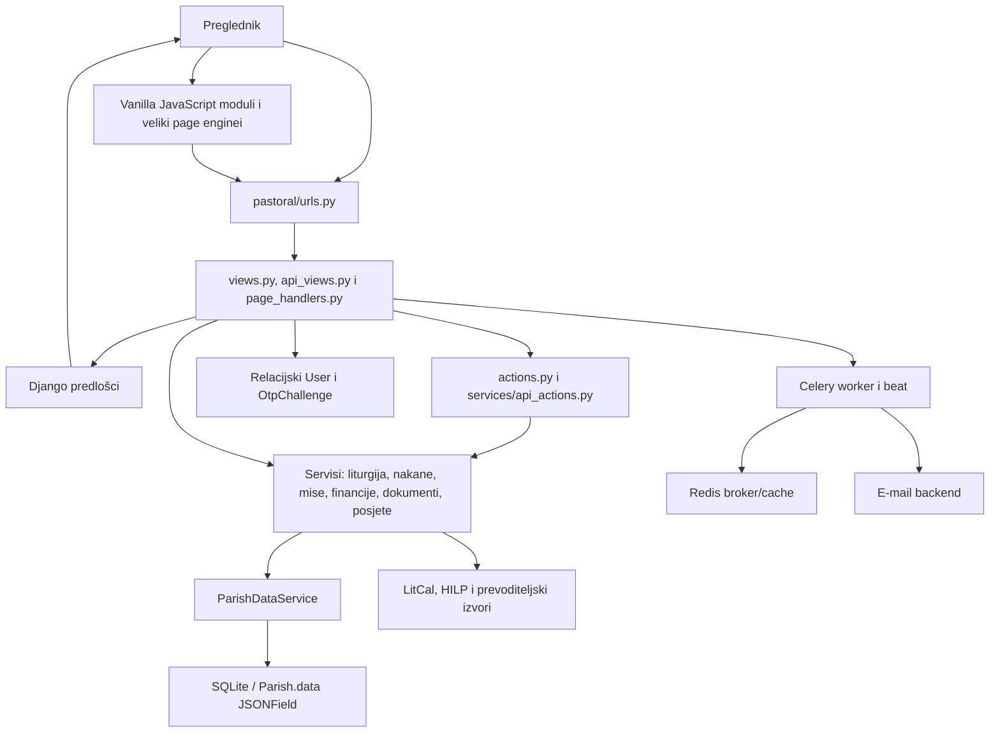
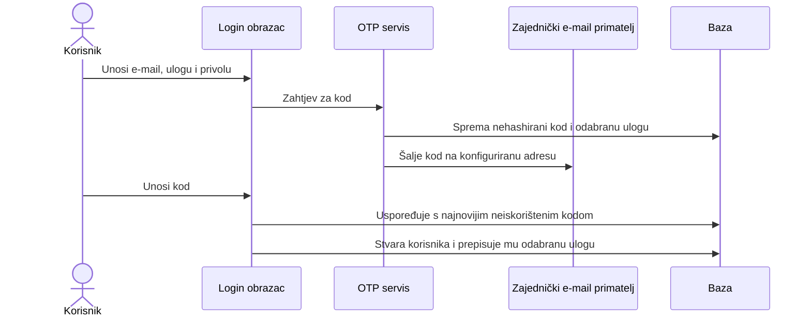
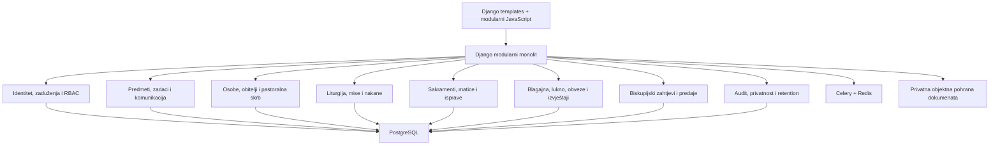

# Analiza postojećeg Django projekta i prijedlog daljnjeg razvoja

Datum analize: 31. srpnja 2026.  
Opseg: cijeli sadržaj projekta `zupa/`, bez pregleda drugih lokalnih direktorija.  
Status dokumenta: radna arhitekturna i proizvodna osnova za zajedničko definiranje funkcionalnosti i modela.

## Sažetak zaključaka

Projekt je funkcionalno bogat frontend prototip župnog ureda izgrađen kao Django monolit s poslužiteljski renderiranim predlošcima, velikom količinom vanilla JavaScripta i jednom JSON strukturom za gotovo sve župne podatke. Vizualni i funkcionalni prototip vrijedi sačuvati i postupno razvijati. Rewrite nije opravdan.

Postojeći backend, međutim, nije sigurna produkcijska osnova. Najkritičniji problemi su prijava kod koje korisnik sam bira ulogu, slanje OTP koda na zajedničku adresu, nedostatak autorizacije na mutacijskim API-jima, pohrana svih osobnih, sakramentalnih i financijskih podataka u jednom JSON polju, nepostojanje audit loga i nepostojanje testova.

Preporučeni smjer je:

1. dovršiti cjeloviti vizualni frontend demo;
2. JSON privremeno zadržati, ali ga odmah strukturirati kao stabilan, verzioniran ugovor buduće baze;
3. ne širiti postojeći proizvoljni JSON bez pravila;
4. prvo definirati organizacije, župna zaduženja, dozvole i sigurnosne granice;
5. nakon potvrde korisničkih tijekova postupno uvoditi relacijske modele po modulima;
6. graditi modularni Django monolit, ne mikroservise i ne novi frontend framework bez jasne potrebe.

Glavna tržišna prilika nije kopiranje portala e-Župe. Proizvod se može izdvojiti kao **operativni sustav župe i digitalni most prema biskupiji**, prilagođen hrvatskim kanonskim, pastoralnim i financijskim pravilima.

## 1. Potvrđeni cilj proizvoda i poslovne odluke

Sustav je namijenjen svećenicima i djelatnicima župnog ureda za upravljanje svakodnevnim radom župe. Ne treba biti portal crkvenih događanja u svijetu.

Potvrđene odluke:

- prva ciljana biskupija je Đakovačko-osječka nadbiskupija;
- sustav se ne smije arhitekturno ograničiti na jednu biskupiju;
- jedan svećenik može biti zadužen za više župa;
- prijava je unosom e-mail adrese i jednokratnog tajnog koda;
- polje „Uloga” uklanja se iz prijave;
- korisnik ne smije sam sebi dodijeliti ulogu;
- pitanje dodjeljuje li pristup biskupijski administrator, župnik ili oboje zasad ostaje otvoreno;
- digitalna matica može biti pomoćna ili službena, ovisno o kasnijoj odluci i pravilima biskupije;
- e-Župe su konkurencija i nije planirana integracija;
- prioritet financija su blagajnički dnevnici, lukno, obveze i biskupijska izvješća;
- potpuno računovodstvo dolazi kasnije;
- osnovni zahtjev za lukno je jasan odgovor je li za obitelj/obveznika u promatranoj godini plaćeno sve ili nije;
- prvo se izrađuje cjelovit frontend demo, a zatim produkcijski backend i baza;
- tijekom frontend faze podaci mogu ostati u JSON-u;
- sigurnost i budući modeli moraju se projektirati prije produkcijskog korištenja.

Otvorena odluka o službenoj ili pomoćnoj digitalnoj matici ne mora blokirati frontend. Demo treba podržati oba režima kroz konfiguraciju biskupijskog profila, ali produkcijska pravila uređivanja, ispravaka, potpisa i čuvanja ovise o konačnoj odluci.

## 2. Metoda analize i provedene provjere

Analizirani su:

- Django postavke, URL konfiguracija, modeli, forme, pogledi, servisi i zadaci;
- svi glavni Django predlošci;
- statički JavaScript, CSS, manifesti i demo podaci;
- migracije, Docker/Celery konfiguracija i popis paketa;
- postojeći Git status, bez mijenjanja zatečenih korisničkih promjena;
- domaći, kanonski, biskupijski i konkurentski izvori navedeni na kraju dokumenta.

### Rezultati provjera prije nadogradnje paketa

| Provjera | Rezultat | Značenje |
|---|---:|---|
| Instalacija izvornog `requirements.txt` u izolirano privremeno okruženje | uspješno | Izvorni skup ovisnosti mogao se instalirati. |
| `pip check` u izoliranom okruženju | bez konflikata | Nije bilo deklariranih konflikata u izvornom skupu. |
| `manage.py check --settings=zupa.settings.local` | 0 problema | Razvojna Django konfiguracija prolazi osnovnu provjeru. |
| `manage.py check --deploy --settings=zupa.settings.production` | 1 greška, 6 upozorenja | Produkcijska konfiguracija nije spremna za deployment. |
| `makemigrations --check --dry-run` | bez novih modelskih promjena | Kod i migracije modela su međusobno usklađeni. |
| `migrate --check` | neuspješno | Migracija `users.0004_remove_kateheta_role` nije primijenjena u zatečenoj bazi. |
| `manage.py test` | 0 testova | Projekt nema automatiziranu regresijsku zaštitu. |

Glavna deployment greška je da produkcijski `STATIC_ROOT` pokazuje na isti direktorij koji je već naveden u `STATICFILES_DIRS` (`zupa/settings/base.py:92`, `zupa/settings/production.py:8`). Upozorenja obuhvaćaju HTTPS preusmjeravanje, HSTS, sigurnost session/CSRF kolačića, slabi rezervni `SECRET_KEY` i zaštitu od prikaza u okviru.

### Nadogradnja paketa izvršena nakon analize

Uz naknadno izričito dopuštenje ažuriran je samo `requirements.txt`:

- Django je podignut na 5.2.16 LTS;
- preostali paketi podignuti su na međusobno razrješive stabilne verzije;
- Redis je ograničen na 6.4.0 jer Kombu Redis transport zahtijeva `redis < 6.5`;
- `pip install --dry-run --ignore-installed --no-cache-dir -r requirements.txt` uspješno je razriješio cijeli skup;
- `git diff --check -- requirements.txt` prolazi.

Paketi nisu instalirani u globalno ili korisničko Python okruženje, pa Django runtime provjere na novom skupu još nisu izvedene. To treba napraviti u projektnom virtualnom okruženju ili Docker slici prije spajanja promjene.

Poseban rizik ostaje `django-ckeditor`: verzija 6.7.3 je zadnja, ali sam održavatelj upozorava da CKEditor 4 ima neispravljene sigurnosne probleme. Paket treba zamijeniti prije produkcije, uz migraciju sadržaja i testiranje sanitizacije.

### Ograničenja istraživanja

Izravno otvaranje PDF-a `zupni-ured.com.hr/manual.pdf` blokirala je zaštita web-stranice. Dostupni indeksirani sadržaj potvrđuje odvojene financije po župi, crveni i plavi blagajnički dnevnik, kvartalni obračunski list te godišnji financijski izvještaj. Zaključci koji ovise o punom priručniku trebaju se naknadno potvrditi ručnim pregledom PDF-a.

## 3. Mapa postojeće arhitekture



### Glavne komponente

- Django projekt: `zupa/`
- aplikacija za korisnike: `users/`
- glavna poslovna aplikacija: `pastoral/`
- predlošci: `templates/`
- statički frontend: `static/`
- demo podaci: `pastoral/fixtures/demo_data.json`
- baza: `db.sqlite3`
- pozadinski poslovi: Celery i Redis
- kontejnersko pokretanje: `docker-compose.yml`

### Podatkovni model danas

Relacijska baza sadrži samo nekoliko stvarnih modela:

- `users.User`: UUID, e-mail, ime, uloga i osnovni kontaktni podaci (`users/models.py:30`);
- `pastoral.Parish`: naziv, slug, postavke i gotovo svi poslovni podaci u `JSONField` poljima (`pastoral/models.py:5`);
- `OtpChallenge`: e-mail, kod, uloga, vrijeme i zastavica iskorištenosti.

`ParishDataService` dohvaća ili automatski stvara zadanu župu, učitava duboku kopiju JSON-a, normalizira je i sprema cijeli dokument natrag (`pastoral/services/data.py:36-73`).

## 4. Glavni tokovi aplikacije

### 4.1. Trenutna prijava OTP kodom



Ovaj tok je demonstracijski, ali produkcijski kritično nesiguran:

- kod se generira s `random.randint`, ne kriptografski sigurnim generatorom (`pastoral/services/otp.py:12`);
- kod se sprema čitljivo;
- nema stvarno primijenjenog roka valjanosti;
- nema ograničenja pokušaja ni brzine slanja;
- korisnik sam odabire ulogu;
- nepoznati e-mail automatski dobiva korisnika;
- uloga se nakon prijave prepisuje iz sesije (`pastoral/views.py:126-130`);
- kod se šalje na centralni `OTP_RECIPIENT`, a ne nužno na uneseni e-mail (`pastoral/services/otp.py:32`);
- OTP kod je vidljiv kroz administraciju.

### 4.2. Interna stranica

1. URL otvara generički ili specifični Django pogled.
2. Dekorator provjerava prijavu i dostupnost stranice.
3. `ParishDataService` učitava cijeli JSON.
4. `page_handlers.py` izrađuje kontekst za traženu stranicu.
5. Predložak se renderira kroz zajednički layout.
6. Globalni i specifični JavaScript nadograđuju interakcije.

### 4.3. Mutacije iz JavaScripta

1. Klijent šalje naziv akcije i payload na `/api/action/`.
2. Veliki dispatcher u `pastoral/services/api_actions.py` odabire funkciju.
3. Funkcija mijenja dijelove učitanog JSON-a.
4. Cijeli JSON sprema se natrag.

Endpoint je samo zaštićen prijavom, bez provedbe dozvole za svaku akciju. U kombinaciji s generičkim `array_key` parametrima (`api_actions.py:374`) to omogućuje zaobilaženje ograničenja navigacije i stranica.

### 4.4. Javni obrasci

Postoje obrasci za krštenje, potvrdu, prvu pričest i sprovod. Podaci se spremaju u `publicSubmissions`, a zatim se šalje Celery zadatak za e-mail. Web zahtjev nakon slanja čeka rezultat zadatka do 20 sekundi (`pastoral/services/public_forms.py:94-102`), čime je web proces i dalje ovisan o dostupnosti workera.

GDPR checkbox se provjerava u obrascu, ali se zatim uklanja iz spremljenog payload-a (`public_forms.py:39`). Ne ostaje dokaz koja je verzija obavijesti prihvaćena, kada i za koju svrhu.

### 4.5. Liturgijski podaci

Lokalne LitCal datoteke pokrivaju 2025., 2026. i 2027. godinu. Servis koristi vanjski LitCal, HILP i prijevod te rezultate sprema u cache na 12 ili 24 sata. Postoji fallback na lokalne podatke, ali dugoročno treba:

- automatizirano godišnje osvježavanje;
- bilježiti izvor i vrijeme dohvaćanja;
- podržati hrvatski nacionalni i biskupijski kalendar;
- omogućiti ovlaštenu ručnu korekciju;
- prikazati korisniku je li podatak lokalni, dohvaćen ili privremeno nedostupan.

## 5. Trenutno stanje frontenda

### Što je dobro

- Velik broj poslovnih ekrana već postoji i omogućuje brzo potvrđivanje koncepta s korisnicima.
- Predlošci imaju zajednički vizualni okvir, navigaciju, temu i kontekst.
- Misne nakane, raspored misa i župni listić imaju razmjerno bogate interaktivne alate.
- Frontend koristi Django CSRF mehanizam za zahtjeve.
- Podaci se na više mjesta sigurno prenose u JavaScript pomoću Django `json_script` pristupa.
- Postoje responzivni elementi, prikazi za ispis i javni obrasci.
- Za frontend-demo strategiju nije potreban prelazak na React/Vue ili potpuni SPA.

### Slabosti i dug

- Jedna CSS datoteka ima više od 6.600 redaka.
- Najveći JavaScript enginei imaju približno 900–1.200 redaka svaki.
- Velik broj globalnih skripti učitava se na zajedničkoj bazi stranice.
- Ne postoje bundler, linter, unit testovi ni end-to-end testovi.
- Dio starih statičkih predložaka, manifesta i demo podataka duplicira ili proturječi Django verziji.
- `package.json` još sadrži ostatke ranijeg Netlify/statičkog prototipa.
- `innerHTML` i `outerHTML` često se koriste. Dio vrijednosti se escapira, ali ne postoji dokaz da su svi putevi sigurni.
- Rich-text sanitizacija odvija se u pregledniku, što nije sigurnosna granica.
- Više predložaka namjerno koristi `|safe`, uključujući ispis dokumenata i župni listić (`templates/pastoral/document_print.html:16`). Spremljeni HTML zato mora proći poslužiteljsku allow-list sanitizaciju.

### Ocjena

Frontend je dobar temelj za demonstrator, ali treba postupno razdvojiti:

- zajedničke komponente;
- module po poslovnim područjima;
- adapter za podatke;
- prikaz, validaciju i mrežnu komunikaciju;
- sanitizaciju i generiranje ispisnih dokumenata.

## 6. Trenutno stanje backenda

### Što je dobro

- Poslovne funkcije su barem djelomično izdvojene u `pastoral/services/`.
- Postoje zasebni servisi za liturgiju, nakane, mise, blagajnu, dugovanja, dokumente, posjete, podsjetnike i javne prijave.
- Django monolit odgovara veličini i domeni proizvoda.
- Celery i Redis su logičan izbor za slanje e-maila i buduće periodične poslove.
- Postoji početna normalizacija starijih verzija demo podataka.

### Glavni problemi

- `pastoral/services/api_actions.py` ima više od 1.100 redaka i obavlja velik broj nepovezanih mutacija.
- `pastoral/views.py` i `users/views.py` također imaju previše odgovornosti.
- `users/views.py` je uglavnom neuvezan, zastarjeli kod koji uvozi nepostojeće module i koristi nepostojeća polja korisnika.
- Nema stvarne organizacijske hijerarhije ni veze korisnik–župa.
- Svi prijavljeni korisnici rade nad jednom zadanom župom.
- Nema transakcija, optimističkog zaključavanja ili detekcije izgubljenih paralelnih promjena cijelog JSON-a.
- Čitanje može implicitno stvoriti i zasijati župu, što skriva promjene stanja.
- Navigacijske dozvole nisu isto što i API autorizacija.
- Za nepoznatu ulogu sustav vraća ovlasti župnika (`pastoral/services/permissions.py:47`), što je fail-open ponašanje.
- Docker produkcijska usluga koristi Django `runserver`.
- Celery beat koristi `DatabaseScheduler`, ali `django_celery_beat` nije pravilno uključen i migriran kao instalirana Django aplikacija.
- ASGI postavljanje `DJANGO_SETTINGS_MODULE` nije sigurno ako varijabla nije postavljena.
- `DEBUG` se čita kao string, pa vrijednost `"False"` može biti tretirana kao istinita.

## 7. Funkcionalna pokrivenost i nedovršeni dijelovi

| Područje | Trenutno stanje | Što nedostaje |
|---|---|---|
| Dashboard | Vizualno bogat demonstrator | Točni prioriteti, sortiranje po rokovima, statusi, odgovornost, drill-down i prikaz po župi. |
| Župe | Jedan `Parish` i zadani slug | Više župa, crkve/kapele, biskupija, dekanat, zaduženja i prebacivanje aktivne župe. |
| Vjernici i obitelji | Demo kartoni, ulice i obitelji | Jedinstvena osoba, kućanstvo, odnosi, duplikati, povijest, privole, komunikacijske preferencije. |
| Posjete | Evidencija i podsjetnici | Planiranje ruta, odgovorna osoba, ponavljanje, pastoralni plan, osjetljive bilješke i strože dozvole. |
| Misne nakane | Jedan od najrazvijenijih modula | Kanonska pravila, stipendije/prilozi, potvrde, prijenos, ispunjenje, konflikti i audit. |
| Raspored misa | Funkcionalni frontend | Iznimke, zamjene, lokacije, odsutnosti svećenika, blagdanski rasporedi i javna objava. |
| Župni listić | Builder i HTML pregled | Verzije, odobrenje, sigurna sanitizacija, zaključavanje izdanja, PDF i distribucija. |
| Sakramenti | Demo evidencije više sakramenata | Kanonske matice, anotacije, formalne korekcije, potvrde, priprava, nedostajući dokumenti i prijenosi među župama. |
| Vjenčanja | Interni demo zapis | Cjelovit ženidbeni postupak i javni upit/prijava, provjera prethodnih sakramenata i prebivališta. |
| Financije | Blagajna, računi i dugovanja kao demo | Crveni/plavi dnevnik, zaključivanje razdoblja, lukno, obveze, izvještajni obrazac, odobrenja i audit. |
| Lukno | Podaci djelomično postoje u obiteljskim demo zapisima | Jasan godišnji status: plaćeno sve / djelomično / nije plaćeno, uplata, iznos i izvještaj po župi. |
| Isprave | Predlošci, generiranje i ispis | Broj dokumenta, potpis/pečat, izvori podataka, nepromjenjiva izdana verzija, opoziv i evidencija izdavanja. |
| Župni ured | Zadaci, objave, kalendar i postavke | Predmeti, urudžbeni zapisnik, ulazna/izlazna pošta, rokovi, odgovorne osobe i primopredaja. |
| Biskupija | Nema stvarnog modula | Zahtjevi, rokovi, dokumenti, parice, izvještaji, status predaje, povrat na doradu i komunikacija. |
| Imovina | Vrlo ograničeno ili bez modula | Nekretnine, pokretnine, kulturna dobra, fotografije, ugovori, osiguranje, održavanje i inventura. |
| Vijeća | Demo podaci | Članovi, mandati, sjednice, odluke, privici i financijska odobrenja. |
| Arhiv | Nije cjelovito modeliran | Klasifikacija, vlasništvo, lokacija, pristup, rok čuvanja, zapisnik predaje i nepromjenjivi trag. |
| Javni zahtjevi | Krštenje, pričest, potvrda i sprovod | Vjenčanje, status zahtjeva, sigurna komunikacija, zaštita od zloupotrebe, privole i rokovi čuvanja. |
| Testovi | Nema testova | Unit, servisni, autorizacijski, integracijski, migracijski i end-to-end testovi. |

## 8. Kanonske i biskupijske obveze koje mijenjaju dizajn

Kanoni 515–552 potvrđuju da je župa pravna osoba u strukturi biskupije, da je župnik zakonski zastupnik i da odgovara za upravljanje dobrima, knjigama i arhivom. Kanon 535 posebno zahtijeva matice, anotacije, potpisanu dokumentaciju, pečat i zaštitu arhiva od neovlaštenog pristupa.

Kanoni 1280–1288 uvode financijsko vijeće ili savjetnike, odobrenja za izvanredno upravljanje, inventar imovine, osiguranje, uredno vođenje prihoda i rashoda, godišnje izvještavanje i sigurno čuvanje isprava.

Đakovačko-osječka sinoda, brojevi 619–640, dodatno navodi:

- matice krštenih, vjenčanih i umrlih;
- knjige katekumena, potvrđenih, prvopričesnika i proviđenih bolesnika;
- urudžbeni zapisnik;
- spomenicu župe;
- blagajnički dnevnik;
- imovnik pokretnina i nekretnina;
- status animarum ili kartoteku;
- zakladne obveze, župne oglase i ženidbene navještaje;
- zaštićeni župni arhiv;
- godišnje parice i pastoralni izvještaj prema kuriji;
- primopredaju cjelokupne administracije i ekonomskog poslovanja pri promjeni župnika;
- jedinstveni umreženi program na razini biskupije.

Novije tumačenje Dikasterija iz 2025. naglašava da se upis u matici krštenih ne briše. Pogreške se ispravljaju, a nove relevantne činjenice dodaju se kao anotacije. Zato produkcijski model ne smije nuditi obični CRUD „uredi/izbriši” za službene matice. Potrebni su izvorni zapis, formalna korekcija ili anotacija, odobrenje, razlog, autor i potpuna povijest.

Posljedica za frontend demo: već sada treba prikazati razliku između radnog zahtjeva, pomoćne evidencije i službenog upisa. Ako demo prikaže slobodno brisanje matice, korisnički tijek bit će pogrešno postavljen i kasnije skup za ispravak.

## 9. Usporedba s konkurencijom i funkcije vrijedne preuzimanja

### e-Župe

e-Župe su prvenstveno portal za vjernike: prijave za sakramente i blagoslov obitelji, župni imenik, događanja, newsletter i donacije. Njihov obrazac za vjenčanje pokazuje koliko je kanonski postupak širi od trenutačnog javnog opsega projekta.

Vrijedi preuzeti:

- strukturirani javni unos;
- status zahtjeva dostupan podnositelju;
- dobro povezivanje zahtjeva s osobom, obitelji i kasnijim upisom;
- detaljniji tijek vjenčanja.

Ne treba kopirati:

- opći portal crkvenih događanja;
- široku javnu župnu tražilicu kao početni prioritet;
- funkcije koje odvlače fokus s rada župnog ureda i biskupije.

### Župni ured

Indeksirani priručnik potvrđuje odvojene financije po župi, crveni i plavi blagajnički dnevnik, kvartalni obračunski list te godišnji financijski izvještaj.

Vrijedi preuzeti osnovni mentalni model koji je hrvatskim korisnicima poznat, ali ga poboljšati:

- jasnim statusom zaključivanja razdoblja;
- automatskim provjerama prije izvještaja;
- vidljivim porijeklom svake brojke;
- revizijskim tragom;
- elektroničkom predajom i povratom na doradu;
- boljim radom na mobitelu i dostupnijim sučeljem.

### Sipa.NET i UniO, Italija

Sipa.NET Talijanske biskupske konferencije ima osobe, sakramente, inventar pokretnina, kanonski ženidbeni postupak, pastoralno i ekonomsko vijeće te tri razine računovodstva: prihodi/rashodi, pojednostavljeno i dvojno knjigovodstvo.

UniO povezuje župe i biskupiju kroz osobe, obitelji, grupe, sakramente, ženidbeni postupak, obavijesti o umrlima, biskupijski kontni plan, godišnji izvještaj, dokumente, rasporede misa i događaje. Posebno je vrijedna standardizacija pri premještaju župnika.

Ovo je najbolji model za prilagodbu:

- biskupijski profil s obrascima, kontnim planom i pravilima;
- isti UX u svim župama;
- kontinuitet podataka neovisno o promjeni svećenika;
- fazno uvođenje računovodstva;
- službeni kanal župa–biskupija;
- centralna pomoć bez dijeljenja korisničkih lozinki.

### ParishSOFT

ParishSOFT objedinjuje obitelji, članove, sakramentalne evidencije, vjeronauk, volontere, darivanje, računovodstvo i biskupijski nadzor. Posebno je koristan model granularnih dozvola za povjerljive sakramentalne podatke i grupno izdavanje potvrda.

Vrijedi prilagoditi:

- dozvole po organizaciji, modulu i operaciji;
- skupni upis i izdavanje potvrda uz stroga pravila;
- biskupijsko izvještavanje bez preuzimanja vlasništva nad svakodnevnim radom župe.

### Vinea

Vinea je bolje usmjerena na stvarni uredski rad od klasičnog „imenika vjernika”. Svaki zahtjev ima vlasnika, sljedeći korak, rok, blokadu i povijest komunikacije. Zahtjev ostaje povezan s osobom, obitelji, sakramentom i potvrdom.

Ovaj model treba implementirati:

- jedinstveni `WorkItem/Case` koncept za krštenje, vjenčanje, sprovod, ispravu ili biskupijski zahtjev;
- odgovornu osobu i zamjenu;
- checklistu i dokumente koji nedostaju;
- rok odgovora i datum sljedećeg kontakta;
- internu primopredajnu bilješku;
- dashboard koji pokazuje što danas traži pozornost.

### Mass Intentions Online

Dobro rješava kalendarski odabir nakane, prilog, automatsku potvrdu, izvoz u župni listić te svećenika s više župa i crkava.

Ovaj model treba prilagoditi:

- jedna nakana povezana s terminom, slavljem, crkvom, celebrantom i prilogom;
- provjera konflikta i dopuštenog broja nakana;
- automatska potvrda i priprema za listić;
- rad preko više župa iz istog korisničkog računa.

### Sacramentum

Korisne funkcije su automatske potvrde, povezivanje naknada i bankovnih uplata, plan obilaska bolesnih, sprečavanje konflikata prostorija, uvjetni obrasci, audit log, uloge i radni prikaz za sakristiju.

Preporuka:

- preuzeti planiranje obilaska, konfliktni kalendar, uvjetne obrasce i audit;
- AI telefonskog asistenta, glasovne obrasce i kioske odgoditi dok temeljni podaci, privatnost i uredski tijekovi nisu stabilni;
- AI kasnije smije predlagati sažetak ili odgovor, ali ne donositi kanonsku, pastoralnu ili financijsku odluku.

### ChMeetings i Planning Center

ChMeetings dobro rješava hijerarhiju: svaka župa radi samostalno, biskupija ima dogovoreni nadzor, a osoba može imati jedan profil kroz više župa. Planning Center je koristan kao referenca za granularne dozvole, radne tijekove, raspoređivanje ljudi i resursa te komunikaciju.

Treba preuzeti organizacijsku hijerarhiju i dozvole, ali ne kopirati protestantski ili generički ChMS model ondje gdje se razlikuje od katoličkih matica, službi i biskupijske strukture.

### Matrica odluke

| Funkcija | Odluka |
|---|---|
| Operativni inbox, vlasnik predmeta i sljedeći korak | Implementirati u frontend demu. |
| Više župa po svećeniku i stalni parish switcher | Implementirati u frontend demu. |
| Biskupijski profil pravila i obrazaca | Implementirati kao konfiguracijski koncept. |
| Elektronička predaja izvještaja biskupiji | Implementirati tijek i statuse u demu. |
| Crveni/plavi blagajnički dnevnik | Implementirati kao financijski prioritet. |
| Lukno: plaćeno sve ili nije | Implementirati jednostavno; detalje proširiti kasnije. |
| Kanonski ženidbeni predmet | Implementirati model i ključne ekrane. |
| Formalne anotacije i korekcije matica | Implementirati UX bez obzira na službeni/pomoćni režim. |
| Plan posjeta bolesnima i povijest obilaska | Implementirati, uz stroge dozvole. |
| Rezervacija prostorija i detekcija konflikta | Korisno nakon osnovnog kalendara. |
| Puno dvojno knjigovodstvo i obračun plaća | Odgoditi. |
| AI telefonski agent i glasovno upravljanje | Odgoditi. |
| Portal svjetskih crkvenih vijesti | Ne implementirati. |

## 10. Prioritetni tehnički problemi i rizici

### P0 — blokira produkciju ili ugrožava podatke

1. **Eskalacija ovlasti kroz prijavu.** Korisnik odabire ulogu i aplikacija je sprema na korisnika. Uloga se mora dodjeljivati iz pouzdanog administrativnog procesa.
2. **Neispravan OTP sigurnosni model.** Centralni primatelj, nehashirani kod, bez roka, pokušaja i rate limita.
3. **Autorizacija samo na UI razini.** Mutacijski API mora provjeriti dozvolu za svaku akciju, aktivnu župu i objekt.
4. **Jedan globalni JSON za sve osjetljive podatke.** Nema izolacije župa, ograničenja, relacija ni sigurnog konkurentnog spremanja.
5. **Nema audit loga.** Nije moguće dokazati tko je promijenio matični, financijski ili osobni zapis.
6. **Nema testova.** Kritični auth, dozvole i financijski izračuni mogu regresirati neprimijećeno.
7. **Osjetljive datoteke u Git repozitoriju.** `.env`, `db.sqlite3` i kompilirani Python artefakti su praćeni, a korijenski `.gitignore` nedostaje. Potrebna je kontrolirana sanacija i eventualna rotacija tajni, ne impulzivno brisanje povijesti.
8. **Moguć stored XSS.** HTML se sprema i renderira s `|safe`; sanitizacija mora biti poslužiteljska.
9. **Produkcijske postavke nisu sigurne.** Wildcard hostovi, rezervni ključ, `runserver`, pogrešan static root i nedostajuće HTTPS/cookie zaštite.

### P1 — visok poslovni i operativni rizik

1. Izgubljene paralelne promjene cijelog JSON dokumenta.
2. Nema multi-parish i biskupijskog modela.
3. Nema formalnih korekcija i anotacija matice.
4. Nema sigurnosne klasifikacije pastoralnih, zdravstvenih i sakramentalnih podataka.
5. Javni obrasci nemaju rate limit, anti-bot zaštitu, pravila privitaka ni retention.
6. Prihvaćena privola se ne evidentira s verzijom, svrhom i vremenom.
7. Web zahtjev sinkrono čeka Celery rezultat.
8. Celery beat konfiguracija nije dovršena.
9. Nema backup/restore postupka, testova obnove ni plana kontinuiteta.
10. Nema formalne primopredaje župe i povijesti zaduženja.

### P2 — održavanje, kvaliteta i skaliranje

1. Prevelike Python, JavaScript i CSS datoteke.
2. Zastarjeli i neuvezani `users/views.py`.
3. Duplicirani demo podaci, manifesti i predlošci.
4. README i konfiguracijske upute ne odgovaraju stvarnom projektu.
5. Neiskorišteni ili nedovoljno konfigurirani paketi povećavaju napadnu površinu.
6. Liturgijski fallback pokriva samo tri godine.
7. Dashboard koristi ukupne brojeve umjesto operativno važnih signala.
8. Nema observabilityja: strukturirani logovi, error tracking, metričke provjere i health endpointi.

## 11. Preporučena arhitektura tijekom frontend-demo faze

JSON ostaje, ali uvodi se ugovor koji imitira buduću bazu:

```json
{
  "schemaVersion": 2,
  "activeParishId": "parish_...",
  "dioceseProfiles": {},
  "parishes": {},
  "churches": {},
  "users": {},
  "assignments": {},
  "people": {},
  "households": {},
  "workItems": {},
  "massIntentions": {},
  "registerEntries": {},
  "cashJournals": {},
  "luknoAssessments": {},
  "obligations": {},
  "diocesanSubmissions": {},
  "documents": {},
  "auditEvents": {}
}
```

Svaki poslovni zapis treba imati:

```json
{
  "id": "stabilni-id",
  "parishId": "parish-id",
  "status": "draft",
  "createdAt": "ISO-8601",
  "createdBy": "user-id",
  "updatedAt": "ISO-8601",
  "updatedBy": "user-id",
  "revision": 1
}
```

Preporuke:

- koristiti objektne mape po ID-u umjesto duboko ugniježđenih kopija iste osobe;
- ne koristiti ime osobe ili redni broj kao identitet;
- svaki zapis obavezno vezati uz župu;
- biskupijska pravila držati u verzioniranom profilu;
- demo akcije voditi kroz jedan frontend data-adapter;
- iz UI komponenti ne pristupati izravno proizvoljnim JSON ključevima;
- zadržati migratore `schemaVersion N -> N+1`;
- dodati simulirani audit događaj za svaki važan demo postupak;
- definirati stanja prazno, učitavanje, greška, bez ovlasti i konflikt, ne samo „happy path”.

Ovakav JSON omogućuje kasniji prijelaz model po model, bez ponovnog crtanja cijelog frontenda.

## 12. Ciljana produkcijska arhitektura



Modularni monolit ostaje jedna Django aplikacija za deployment, ali poslovni moduli dobivaju jasne granice. Mikroservisi bi u ovoj fazi povećali trošak, sigurnosnu površinu i operativnu složenost bez poslovne koristi.

### Predloženi moduli

1. `organizations`: biskupije, dekanati, župe, crkve, kapele i biskupijski profili.
2. `identity`: korisnici, župna zaduženja, uloge, dozvole i sesije.
3. `people`: osobe, kućanstva, odnosi, adrese, kontakti, privole i pastoralna skrb.
4. `office`: predmeti, inbox, zadaci, rokovi, komunikacija, urudžbeni zapisnik i primopredaja.
5. `liturgy`: rasporedi, iznimke, slavlja, celebranti, nakane i prilozi.
6. `sacraments`: priprava, slavlja, registri, anotacije, korekcije i potvrde.
7. `finance`: blagajnički dnevnici, lukno, obveze, izvještaji i kasnije računovodstvo.
8. `documents`: predlošci, izdane verzije, privici, potpis/pečat i arhiv.
9. `diocese`: zahtjevi, obrasci, predaje, rokovi, poruke i povrat na doradu.
10. `audit`: nepromjenjivi događaji, pristupi osjetljivim podacima i retention.
11. `liturgical_calendar`: izvori, cache, korekcije i provenance.

## 13. Početni prijedlog domenskih modela

Modeli nisu konačna specifikacija, nego sigurna osnova za zajedničko oblikovanje.

### Organizacija i pristup

- `Diocese`
- `Deanery`
- `Parish`
- `ChurchLocation`
- `User`
- `ParishAssignment`: korisnik, župa, služba/uloga, početak, kraj, status
- `Role`
- `Permission`
- `RolePermission`

Otvoreno pitanje tko dodjeljuje pristup rješava se politikom i workflowom, ne promjenom osnovnog modela. `ParishAssignment` može nastati kroz biskupijsko odobrenje, župnikov poziv ili kombinirani tijek.

### Osobe i obitelji

- `Person`
- `Household`
- `HouseholdMember`
- `Relationship`
- `Address`
- `ContactPoint`
- `ParishAffiliation`
- `ConsentRecord`
- `CommunicationPreference`
- `PastoralVisit`
- `PastoralCarePlan`

Korisnički račun nije isto što i osoba u župnoj evidenciji. Jedna osoba može postojati bez prijave, a korisnik može imati više župnih zaduženja.

### Uredski predmeti

- `WorkItem`
- `WorkItemType`
- `ChecklistItem`
- `Assignment`
- `Deadline`
- `InternalNote`
- `Communication`
- `Attachment`
- `StatusTransition`

`WorkItem` je zajednička osnova za zahtjev za krštenje, vjenčanje, sprovod, ispravu, prijavu obitelji ili zadatak biskupije.

### Sakramenti i matice

- `RegisterBook`
- `RegisterEntry`
- `SacramentCelebration`
- `RegisterAnnotation`
- `CorrectionRequest`
- `CorrectionApproval`
- `CertificateTemplate`
- `IssuedCertificate`
- `InterParishNotice`

Službeni zapis ne briše se. Poništenje ili ispravak mora biti novi, sljedivi događaj.

### Liturgija i nakane

- `MassScheduleRule`
- `MassScheduleException`
- `MassCelebration`
- `MassIntention`
- `IntentionOffering`
- `IntentionTransfer`
- `CelebrantAssignment`

### Financije — početni opseg

- `CashJournal`
- `CashJournalEntry`
- `ReceiptOrExpenseDocument`
- `LuknoAssessment`
- `LuknoPayment`
- `Obligation`
- `FiscalPeriod`
- `ReportDefinition`
- `ReportSubmission`
- `Approval`

Minimalni `LuknoAssessment` treba sadržavati godinu, župu, obitelj/obveznika, očekivani iznos ako se koristi, uplaćeni iznos, datum posljednje uplate i izvedeni status:

- `paid` — plaćeno sve;
- `partial` — djelomično plaćeno;
- `unpaid` — nije plaćeno;
- `not_applicable` — samo ako se kasnije potvrdi potreba.

Za početni UX najvažniji je binarni pregled „plaćeno sve / nije plaćeno”, dok detalj zapisa može razlikovati djelomičnu uplatu.

### Kasnije financijsko proširenje

- kontni plan i fondovi;
- dvostavno knjiženje;
- budžet;
- bankovni izvodi i usklađenje;
- donacije i namjenska sredstva;
- imovina, osiguranje i ugovori;
- pragovi i dvostruko odobrenje;
- konsolidirano biskupijsko izvještavanje.

## 14. Preporučeni sigurnosni model prijave

1. Korisnik unosi samo e-mail.
2. Sustav uvijek vraća generičku poruku da je kod poslan ako je adresa dopuštena, kako se ne bi otkrivali računi.
3. Provjerava se postoji li aktivno zaduženje ili pozivnica.
4. Prethodni neiskorišteni kodovi za adresu se poništavaju.
5. Kod se generira modulom `secrets`, sprema samo kao hash i vrijedi najviše 10 minuta.
6. Uvode se cooldown i rate limit po adresi, IP-u i sesiji.
7. Dopušta se najviše pet pogrešnih pokušaja.
8. Uspješna prijava rotira session ključ i zapisuje audit događaj.
9. Ako korisnik ima jednu župu, ulazi izravno; ako ih ima više, bira aktivnu župu.
10. Uloge i dozvole dolaze isključivo iz aktivnog `ParishAssignment` zapisa.
11. Promjena aktivne župe ponovno određuje dozvole i scope svih upita.
12. Za biskupijske administratore, financijske ovlasti i promjene službenih matica preporučuje se dodatni MFA/WebAuthn.

## 15. Prijedlog novog dashboarda

Dashboard treba biti „operativni kokpit župe”, ne zbirka ukupnih brojeva.

### Stalni vrh

- aktivna župa i brzo prebacivanje župe;
- svetac/blagdan dana;
- liturgijska boja i rang;
- čitanja s izvorom;
- današnje mise i celebranti;
- upozorenje ako liturgijski podaci nisu potvrđeni ili su iz fallbacka.

### Što danas traži pozornost

- neodgovoreni javni zahtjevi;
- predmeti bez odgovorne osobe;
- rokovi koji istječu;
- nepotpuna dokumentacija za skori sakrament;
- neusklađena ili neispunjena misna nakana;
- zadatak ili zahtjev biskupije;
- financijska obveza pred dospijećem.

### Župni ured

- novi zahtjevi;
- isprave za izdavanje ili potpis;
- predmeti vraćeni na doradu;
- poruke i zadaci s vlasnikom;
- uredovno vrijeme i današnji termini.

### Pastoralna skrb

- bolesni i stariji kojima je posjet dospio;
- obitelji koje dugo nisu posjećene;
- novo prijavljene obitelji;
- pastoralni podsjetnici;
- samo minimalni potrebni podatak, bez prikazivanja osjetljive bilješke na dashboardu.

### Liturgija

- današnje i sljedeće mise;
- nakane po misi;
- slobodni termini;
- konflikti celebranta/lokacije;
- nakane bez uplate, potvrde ili ispunjenja;
- sljedeći župni listić i status pripreme.

### Financije

- stanje otvorenog blagajničkog razdoblja;
- neproknjiženi ili nepotpuni unosi;
- obveze koje dospijevaju;
- lukno: broj obitelji „plaćeno sve” i „nije plaćeno” za godinu;
- status kvartalnog/godišnjeg biskupijskog izvještaja;
- financije se prikazuju samo ovlaštenim korisnicima.

### Donji blokovi

Misne nakane, sakramenti i prioritetni zadaci trebaju ostati, ali kao filtrirane radne liste s jasnim sljedećim korakom. Statični ukupni broj krštenja ili zadataka ima manju vrijednost od podatka „3 predmeta nemaju dokumente, prvi rok je sutra”.

## 16. Prioritizirani plan rada

### Faza 0 — odluke i zaštitne ograde

Prioritet: P0

- potvrditi navigaciju i kompletan popis demo ekrana;
- definirati biskupijski profil Đakovačko-osječke nadbiskupije;
- definirati JSON v2 ugovor, ID-jeve, stanja i audit događaje;
- definirati role/permission matricu, uz otvoren workflow dodjele pristupa;
- definirati razliku radni predmet / pomoćna evidencija / službena matica;
- pripremiti minimalni sigurnosni threat model i klasifikaciju podataka;
- uspostaviti testni okvir prije većih refaktora.

### Faza 1 — cjeloviti frontend demo

Prioritet: P0/P1

- ukloniti ulogu s login ekrana;
- prikazati e-mail OTP tok bez demonstracijskog sigurnosnog ponašanja u tekstu ili UX-u;
- dodati parish switcher i stanja korisnika s jednom/više župa;
- preurediti dashboard prema operativnom modelu;
- implementirati zajednički inbox/predmet/vlasnik/rok;
- dovršiti module Župa i vjernici, Liturgija, Sakramenti, Financije, Isprave i Župni ured;
- dodati Biskupija modul: zahtjevi, rokovi, dokumenti i predaje;
- dodati primopredaju župe, imovinu i arhiv kao demonstracijske cjeline;
- implementirati crveni/plavi blagajnički dnevnik, obveze, lukno i izvještaje;
- prikazati formalne anotacije i ispravke matice;
- dodati sve prazne, grešne, zaključane i „bez ovlasti” prikaze;
- provesti razgovore i usability testove sa svećenicima i djelatnicima ureda.

### Faza 2 — sigurnost i tehnički temelj

Prioritet: P0

- napraviti stvarni OTP prema opisanom modelu;
- uvesti korisnička zaduženja po župi i objekt-level scope;
- autorizirati svaku API akciju;
- fail-closed permissions;
- dodati audit log i zapis pristupa osjetljivim podacima;
- ukloniti ili izolirati `reset_demo` iz produkcije;
- uvesti poslužiteljsku sanitizaciju HTML-a;
- rate limit i anti-abuse zaštita javnih obrazaca;
- sigurno upravljanje tajnama i korektan `.gitignore`;
- produkcijske postavke, Gunicorn/ASGI server, HTTPS i health checks;
- popraviti Celery beat instalaciju i ukloniti sinkrono čekanje zadataka.

### Faza 3 — relacijski organizacijski i uredski modeli

Prioritet: P1

- PostgreSQL;
- biskupija, dekanat, župa i crkvena lokacija;
- korisnik i župno zaduženje;
- osobe, obitelji, adrese i odnosi;
- predmeti, zadaci, komunikacija i privici;
- migrator iz JSON v2;
- privremeni dual-read adapter samo gdje je nužno;
- testovi izolacije župa i dozvola.

### Faza 4 — sakramenti, matice i dokumenti

Prioritet: P1

- registri i upisi;
- anotacije i odobrene korekcije;
- priprava i checklistovi;
- međužupne obavijesti;
- izdavanje potvrda s nepromjenjivom verzijom;
- pečat/potpis i evidencija izdavanja;
- parice i arhiv;
- odluka o službenom ili pomoćnom režimu prije produkcijskog puštanja.

### Faza 5 — prioritetne financije

Prioritet: P1

- crveni i plavi blagajnički dnevnik;
- zaključavanje razdoblja;
- lukno;
- obveze;
- porijeklo svake stavke izvještaja;
- kvartalni i godišnji biskupijski izvještaji;
- predaja, povrat na doradu i odobrenje;
- financijsko vijeće i pragovi odobrenja gdje su potrebni.

### Faza 6 — biskupijski rad i kontinuitet

Prioritet: P1/P2

- dvosmjerna komunikacija župa–biskupija;
- verzionirani obrasci i rokovi;
- biskupijski dashboard dogovorenih podataka;
- primopredaja župe;
- inventar, fotografije, ugovori i osiguranje;
- standardizirani izvoz i dugoročni arhiv.

### Faza 7 — proširenja

Prioritet: P2

- potpuno računovodstvo;
- bankovno usklađenje;
- prostorije i resursi;
- napredna mobilna podrška i ograničeni offline rad;
- pažljivo odabrane AI asistencije s ljudskim odobrenjem;
- API integracije samo ako se pojavi stvarna poslovna potreba.

## 17. Testna strategija

Minimalni skup prije produkcije:

- unit testovi JSON migratora i financijskih izračuna;
- servisni testovi za matice, anotacije, nakane i izvještaje;
- autorizacijska matrica: svaka uloga × svaka akcija × vlastita/tuđa župa;
- OTP testovi roka, pokušaja, ponovnog slanja, rate limita i poništenja;
- testovi paralelnih promjena i revizije;
- testovi da se službeni upis ne može izbrisati;
- testovi sanitizacije dokumenta i župnog listića;
- testovi javnih obrazaca, privole i anti-abuse zaštite;
- migracijski testovi JSON → relacijski model;
- end-to-end testovi pet najvažnijih tokova;
- restore test iz sigurnosne kopije;
- deployment check kao obvezni CI korak.

Pet početnih end-to-end tokova:

1. prijava korisnika i izbor jedne od više župa;
2. zahtjev za krštenje → obrada → slavlje → matični upis → potvrda;
3. misna nakana → slobodni termin → prilog → izvršenje → župni listić;
4. blagajnički unos → zaključivanje → biskupijski izvještaj;
5. biskupijski zahtjev → župna obrada → predaja → povrat ili prihvat.

## 18. Privatnost i zaštita podataka

Podaci o vjerskom uvjerenju spadaju u posebne kategorije osobnih podataka prema članku 9. GDPR-a. Projekt također obrađuje podatke djece, obitelji, sakramenata, mogućeg zdravstvenog stanja, financija i pastoralnih posjeta.

Potrebno je projektirati:

- pravnu osnovu i svrhu po kategoriji podataka;
- najmanji potreban skup podataka;
- dozvole po polju ili osjetljivoj kategoriji gdje je potrebno;
- rokove čuvanja i iznimke za kanonske matice;
- zapis verzije obavijesti i privole;
- izvoz, ispravak i druge zahtjeve ispitanika bez nezakonitog brisanja matice;
- enkripciju prijenosa i pohrane;
- sigurnosne kopije i test obnove;
- evidentiranje pristupa posebno osjetljivim zapisima;
- ugovore s izvršiteljima obrade i lokaciju podataka;
- incident response i procjenu učinka na zaštitu podataka prije šireg uvođenja.

Točne pravne i kanonske politike trebaju potvrditi ovlašteni pravni i crkveni stručnjaci. Tehnička arhitektura mora ih moći provesti i dokazati.

## 19. Otvorena poslovna pitanja

1. Tko konačno odobrava župno zaduženje: biskupijski administrator, župnik ili kombinirani workflow?
2. Kada digitalna matica postaje službena i koji su tada obvezni potpis, pečat, zaključavanje i postupak ispravka?
3. Koji točan obrazac i izračun koristi Đakovačko-osječka nadbiskupija za crveni/plavi dnevnik i izvještaje?
4. Postoji li propisani iznos lukna ili se samo evidentira dobrovoljna/utvrđena obveza i potpuna uplata?
5. Koje uloge trebaju postojati osim župnika i vikara: administrator ureda, računovođa, ekonom, član vijeća, kateheta i biskupijski preglednik?
6. Koje podatke biskupija smije vidjeti kontinuirano, a koje tek nakon formalne predaje?
7. Treba li podržati župe s više crkava, kapela, OIB-a, blagajni i bankovnih računa od prve verzije?
8. Koji se postojeći podaci moraju uvesti iz Excela, starih aplikacija ili papira?
9. Treba li javni portal omogućiti samo predaju zahtjeva ili i siguran pregled statusa i dopunu dokumenata?
10. Koja je ciljana politika hostinga, lokacije podataka i podrške za župe sa slabijom internetskom vezom?

## 20. Preporučeni neposredni sljedeći korak

Ne treba odmah refaktorirati cijeli backend. Najkorisniji sljedeći razvojni korak je izraditi **mapu kompletnog frontend dema**:

1. popis persona i njihovih dopuštenih pogleda;
2. navigacijsku mapu svih modula;
3. 10–15 ključnih end-to-end korisničkih scenarija;
4. JSON v2 podatkovni ugovor;
5. wireframe novog dashboarda;
6. statusni model zajedničkog uredskog predmeta;
7. prototip prebacivanja između više župa;
8. prototip Biskupija inboxa i predaje izvještaja;
9. prototip matičnog upisa s anotacijom/korekcijom;
10. prototip blagajničkog dnevnika, lukna i godišnjeg izvještaja.

Nakon što svećenici i djelatnici potvrde te tokove, backend se može graditi postupno iza stabilnog sučelja i podatkovnog ugovora. Time se čuva vrijednost postojećeg rada, smanjuje rizik pogrešnih modela i izbjegava rewrite.

## 21. Status vizualnog prototipa nakon prve nadogradnje

Prvi cilj iz prethodnog poglavlja sada je djelomično realiziran u postojećem Django frontendu, bez rewritea i bez uvođenja relacijskih poslovnih modela prije potvrde sučelja.

Implementirano je:

- novi operativni dashboard koji spaja liturgijski dan, današnje mise, jedinstveni inbox, brze radnje, pastoralnu pokrivenost, lukno, sakramentalni pipeline, trag aktivnosti i centar biskupijskih izvješća;
- Chart.js 4.5.1 grafovi nad postojećim JSON podacima za novčani tok, misne nakane, blagajnu i financijska izvješća;
- redizajnirana blagajna s kontrolom plavog/crvenog dnevnika, kompletnosti unosa, mjesečnim grafom i jasnim statusom usklađenja;
- redizajnirano financijsko izvještajno središte s kvartalnim workflowom, kontrolnom listom za biskupiju i pregledom kategorija;
- višežupni kontekst u glavnom zaglavlju kao osnova za budući parish switcher;
- vidljiva globalna pretraga uz postojeći prečac `Ctrl/Cmd + K`;
- sklopivi sidebar: potpuno zatvaranje/otvaranje na desktopu te hamburger/off-canvas navigacija na mobitelu;
- modul „Dekanat i suradnja” sa sigurnim međužupnim predmetima, direktorijem župa, inboxom/outboxom, SLA rokovima, vlasnikom predmeta, kontrolnim listama, privitcima, porukama i audit tragom;
- reprezentativni JSON demo za potvrdu u ženidbenom postupku, delegaciju, zamjenu svećenika i prijenos misnih nakana; ne generiraju se masovni podaci o vjernicima;
- međužupni predmeti uključeni su u globalnu pretragu, podsjetnike, dashboard i navigacijske značke;
- uklonjeno vidljivo polje „Uloga” iz OTP prijave; postojeća uloga korisnika određuje se prema njegovoj e-mail adresi, a korisnik je više ne bira sam;
- zajednički profesionalni stilovi za KPI kartice, filtre i tablice na svim postojećim modulima;
- uspješan sintaksni pregled Python, Django template i JavaScript datoteka;
- uspješan read-only Django render svih 27 administrativnih ekrana nad postojećim lokalnim podacima.

Sljedeći vizualni prioriteti trebaju biti:

1. proširiti potvrđeni model međužupnog predmeta na javne prijave, sakramente i isprave;
2. detaljni sakramentalni checklisti i status dokumentacije;
3. karta/ruta pastoralnih posjeta i pokrivenost ulica;
4. Biskupija inbox, povrat na doradu i formalna predaja izvješća na istom predmetnom modelu;
5. portfolio više župa s agregiranim i pojedinačnim pokazateljima;
6. export grafova i izvješća u PDF/Excel nakon potvrde konačnih obrazaca;
7. vizualni prototip matičnog upisa s anotacijama i neizbrisivim tragom izmjena.

## 22. Druga vizualna nadogradnja: operativno središte cijele župe

### Popravak dekanatskog outbox prikaza

Problem na ruti `pages/dekanat/?view=outbox&request=ipr-2026-0040` nije bio samo u jednom tekstu ili kartici. Ekran je imao tri konkurentska stupca, a prijelomne točke računale su se prema širini cijelog prozora. Kada je sidebar bio otvoren, stvarni prostor za detalj predmeta bio je manji od onoga što su media queryji pretpostavljali.

Popravak je izveden postupno, bez rewritea:

- desni analitički blokovi premješteni su u stabilnu mrežu ispod radnog prostora;
- glavni inbox i detalj predmeta reagiraju na stvarnu širinu roditeljskog sadržaja pomoću CSS container queryja;
- činjenice, privitci i checklist automatski prelaze iz više stupaca u jedan;
- dugi nazivi župa, osoba, predmeta i poruka više ne mogu prisilno proširiti karticu;
- na uskom prikazu inbox i detalj postaju jedan vertikalni tok bez skrivenih dijelova.

### Operativno središte

Dodan je novi modul `Operativno središte`. Njegova svrha nije stvoriti još jednu odvojenu evidenciju, nego objediniti sve ono što inače završava u privatnom e-mailu, WhatsAppu, papirnatoj bilježnici, Excelu ili sjećanju župnika.

Vidljivo i funkcionalno u JSON demu:

- jedinstveni radni red s vlasnikom, rokom, prioritetom, statusom i sljedećim korakom;
- ulazna i izlazna pošta s automatskom urudžbenom oznakom;
- telefonski, osobni, e-mail, poštanski, biskupijski i javni kontakti u istom modelu;
- odobrenja s prikazom potrebnih i dovršenih koraka;
- planiranje ciljane komunikacije prema skupinama i kanalima;
- kvarovi, održavanje, procijenjeni trošak, izvođač i povezani objekt;
- termini župnog ureda i rano upozorenje na koliziju prostora;
- rasporedi čitača, ministranata, djelitelja pričesti i drugih službi s vidljivim prazninama;
- sigurnosne i usklađujuće kontrole, uključujući test obnove sigurnosne kopije, pregled pristupa i usklađenje matica;
- ugovori, obnova osiguranja i rokovi otkaza;
- trajna primopredajna knjiga župe za kanonsko-pravne, financijske, imovinske, pastoralne i digitalne obveze;
- kontrola kvalitete podataka koja ne skriva nepotpune kontakte, nepovezane ulice ili prazne matične evidencije.

Nove JSON akcije omogućuju evidentiranje uredskog kontakta, prijavu održavanja, spremanje plana komunikacije i promjenu statusa operativne stavke. Stvarno slanje SMS-a ili e-maila namjerno nije simulirano kao dovršena funkcija: demo sprema plan i jasno pokazuje da integracija dostave tek treba biti izrađena.

### Pastoralni radar kao razlika prema konkurenciji

`Pastoralni radar` predlaže trenutke koji bi mogli tražiti pozornost, primjerice propušten redoviti posjet bolesniku, nedostajući dokument prije sakramenta ili obitelj bez zabilježenog pastoralnog posjeta.

Zaštitne ograde su mandatorne:

- radar ne smije rangirati vjeru, moralnost, vrijednost osobe ili „angažman” vjernika;
- svaki prijedlog mora objasniti iz kojih konkretnih unesenih podataka proizlazi;
- svećenik zadržava pastoralnu prosudbu i može odbaciti prijedlog;
- zdravstveni i drugi strogo povjerljivi detalji ne smiju se kopirati u opći radni red;
- produkcijska verzija mora bilježiti pristup osjetljivim zapisima.

Ova kombinacija objašnjivog pastoralnog radara, kontinuiteta primopredaje i jednog predmeta kroz župu, dekanat i biskupiju može biti snažnija tržišna razlika od običnog povećanja broja tablica.

### Što je sada vidljivo na svim ekranima

- stalni gumb `Radni red` u gornjoj navigaciji;
- broj stavki koje traže pozornost;
- poveznica iz zajedničke kontekstne trake;
- operativne stavke u globalnoj pretrazi;
- operativni rizici u postojećim podsjetnicima i dashboard inboxu;
- stari ulazi `poruke`, `komunikacija` i `sigurnost` vode u novo središte umjesto na nepovezane stranice.

Izolirani render prošao je za svih 27 administrativnih ruta. Posebno su renderirani problematični dekanatski outbox predmet i novi operativni ekran. In-memory workflow test prošao je za četiri nove akcije bez pisanja u bazu ili projektne JSON podatke.

### Što još nije produkcijski dovršeno

- stvarna dostava e-maila, SMS-a, aplikacijskih i tiskanih kampanja;
- sigurna pohrana privitaka, antivirusna provjera i granularne dozvole;
- relacijski model uredskog predmeta, osobe, organizacije, objekta i komunikacijskog pristanka;
- digitalni potpis, pečat, formalna odobrenja i neizbrisivi audit log;
- točni biskupijski pragovi izvanrednog upravljanja;
- sigurnosne provjere osoba koje rade s djecom prema potvrđenom pravnom i crkvenom postupku;
- stvarno upravljanje ključevima, uređajima, policama osiguranja i inventarom;
- offline rad i red čekanja za sinkronizaciju u župama sa slabom vezom.

### Uvid iz nove provjere konkurencije

ParishSOFT objedinjuje facility calendar, ministry scheduler, safe-environment provjere, komunikaciju, obitelji, darivanje i financije. ChurchDesk posebno naglašava kalendar, upravljanje prostorijama, rasporede osoblja i volontera, godišnjice, rezervacije, komunikaciju i GDPR. Zaključak nije da treba slijepo kopirati njihove module, nego da je za potpuni župni ured potrebno povezati ljude, prostore, komunikaciju i upravljanje rizikom s pastoralnim i kanonskim predmetima.

Naša ciljana razlika:

1. jedan predmet od prvog kontakta do sakramenta, dokumenta, uplate, matice i biskupijske predaje;
2. hrvatski kanonski, biskupijski i blagajnički kontekst, a ne generički CRM;
3. međužupna suradnja i biskupijski workflow kao temelj proizvoda;
4. objašnjivi pastoralni radar bez manipulativnog bodovanja vjernika;
5. primopredajna knjiga koja smanjuje ovisnost župe o privatnim bilješkama jedne osobe;
6. vidljiva kvaliteta podataka: aplikacija govori što ne zna.

## 23. Treća nadogradnja: postojeći ekrani kao radni alati župnika

Ova iteracija nije usmjerena na dekorativno redizajniranje. Na svim starim administrativnim ekranima uveden je isti operativni mentalni model: **što traži pozornost, što nedostaje, tko je odgovoran i koji je preporučeni sljedeći korak**. Sažeci se računaju iz postojećih JSON podataka i ne predstavljaju izmišljene poslovne rezultate.

### Zajednički kontekst na postojećim ekranima

Kontekstualni operativni sažetak sada se prikazuje na modulima obitelji, ulica, posjeta, liturgije, sakramenata, ureda, javnih prijava, matica, dokumenata, financija, vijeća i postavki. Dashboard, dekanat i operativno središte zadržavaju vlastite specijalizirane sažetke.

Sažetak je namjerno kompaktan i prikazuje:

- najviše četiri pokazatelja koji pomažu odluci;
- upozorenja za prekoračen rok, nedostajući kontakt, dokument, vlasnika ili klasifikaciju;
- preporučenu sljedeću radnju s izravnom poveznicom na pripadajući predmet;
- kontrolnu listu tamo gdje zapis prolazi više obveznih koraka.

### Obitelji i pastoralna skrb

Karton obitelji sada daje prednost odnosu i pastoralnoj skrbi, a ne luknu:

- ispravljena su pogrešna polja članova: prikazuju se postojeći `relation` i `birthYear`, umjesto nepostojećih `role` i `birthDate`;
- vidljivi su zadnji posjet, otvoreni posjeti, preferirana misa, status kartona, oznake i pastoralna bilješka;
- karton izravno nudi poziv, e-mail i planiranje posjeta s unaprijed popunjenom obitelji i adresom;
- prikazuje se povijest pastoralne skrbi i ishod posjeta;
- popis obitelji ističe star ili nepostojeći posjet te nedostajući kontakt;
- lukno ostaje u kartonu, ali je izričito odvojeno od pastoralne procjene osobe ili obitelji.

Sljedeći korak za ovaj modul je karta/ruta po ulicama, ponavljajući raspored kućne pričesti, kontaktne preferencije i granularno povjerljive bilješke. Pastoralna bilješka ne smije postati opći CRM komentar dostupan svima.

### Posjeti

Evidencija posjeta sada razlikuje otvoreno, prekoračeno, redovitu kućnu pričest i obavljen posjet bez izvještaja. Obitelj se može prenijeti iz kartona u obrazac posjeta bez ponovnog prepisivanja.

Uvedena je važna operativna zaštita: posjet se ne može označiti obavljenim dok nije upisan kratak ishod i sljedeći korak. Zapis posjeta više se ne briše običnim gumbom. Potreban je budući statusni tijek `planirano → potvrđeno → obavljeno / otkazano`, uz razlog otkazivanja i audit trag.

### Kalendar, događaji i zadaci

Prethodni ekran mogao je dodati samo zadatak, bez odgovorne osobe. Sada:

- svaki novi zadatak traži vlasnika;
- moguće je dodati župni događaj/termin s datumom, vremenom, prostorom, vrstom, vlasnikom i napomenom;
- kalendar na danu pokazuje broj događaja i otvorenih zadataka;
- dnevni prikaz spaja događaje i rokove;
- sustav upozorava na dva događaja u istom prostoru i vremenu;
- novi unos odbija identično preklapanje prostora, datuma i vremena.

Za produkcijski model još trebaju ponavljanje, trajanje, rezervacija resursa, sudionici, privatnost termina, zamjena odgovorne osobe i sinkronizacija s vanjskim kalendarom. Integracija ne smije biti preduvjet za osnovni rad.

### Javne prijave

Javne prijave sada imaju operativnu trijažu prije uvoza:

- pretraga i filtar po vrsti obrasca;
- starost prijave u radnom redu;
- provjera spremljene privole, dostupnog kontakta i poznate teritorijalne nadležnosti;
- upozorenje na mogući duplikat prema postojećim sakramentalnim zapisima;
- pregled svih predanih podataka prije uvoza;
- jasna razlika između uvoza u predmet i arhiviranja bez uvoza.

Ispravljena je stvarna funkcionalna pogreška: javni obrazac spremao je tipove `prijava-krsenje`, `prijava-krizma`, `prijava-pricest` i `prijava-ukop`, dok je uvoz očekivao `krstenje`, `krizma`, `pricest` i `ukop`. Tipovi se sada normaliziraju prije uvoza. Novi zapisi spremaju dokaz da je obvezna privola prihvaćena, vrijeme prihvaćanja i verziju obavijesti o privatnosti.

Produkcijska verzija treba imati bolju detekciju duplikata, ručnu potvrdu nadležnosti, sigurno traženje dopune i portal na kojem podnositelj može pratiti samo svoj zahtjev.

### Sakramentalni predmeti

Krštenje, vjenčanje, pogreb i pomazanje više se ne prikazuju samo kao financijski/statusni redovi. Svaki red sada ima referencu predmeta, spremnost, broj nedostajućih koraka, preporučeni sljedeći korak i otvarajuću kontrolnu listu.

Primjeri kontrola:

- krštenje: roditelji, termin, kumovi, potvrda kuma, celebrant i, nakon slavlja, upis u maticu;
- vjenčanje: termin, dokumenti, priprava, celebrant i kontakt para, uz izravan početak međužupnog zahtjeva za potvrdu;
- pogreb: termin, kontakt obitelji, celebrant, groblje i misa zadušnica;
- pomazanje: kontakt, lokacija, termin, svećenik i ishod posjeta.

Uklonjeni su vidljivi gumbi za trenutno brisanje ovih redova. Sljedeći razvoj mora uvesti pravi ekran predmeta s kontroliranim ispravkom, otkazivanjem nacrta, zaključavanjem nakon slavlja i vezom na maticu, ispravu, uplatu, komunikaciju i audit log.

### Matične knjige

Obično brisanje matične knjige uklonjeno je iz sučelja i blokirano u poslužiteljskom handleru. Promjena lokacije ili statusa mora sačuvati skrbnika i razlog. Ovo je ispravna zaštitna ograda neovisno o još otvorenoj odluci hoće li digitalna matica biti službena ili pomoćna.

Sljedeći prototip treba prikazati fizičko-digitalno usklađenje, anotaciju, ispravak bez prepisivanja povijesti, dvostruku kontrolu i dokaz tko je te kada usporedio zadnji broj.

### Provjere nakon nadogradnje

| Provjera | Rezultat |
|---|---:|
| Python sintaksa i JSON valjanost | prolazi |
| `git diff --check` | bez whitespace pogrešaka |
| Izolirani Django render svih administrativnih ruta | 27/27 prolazi |
| Validacija događaja i obveznog vlasnika zadatka | prolazi |
| In-memory uvoz javnog obrasca `prijava-krsenje` | prolazi |
| Standardni `python manage.py check` u trenutačnom lokalnom interpreteru | blokiran jer okruženju nedostaje instalirani `admin_interface` |

Paket je deklariran u `requirements.txt`; potrebno je ponovno instalirati ažurirane ovisnosti u aktivno razvojno okruženje prije standardne Django provjere. Izolirani render nije zamjena za produkcijske integracijske i sigurnosne testove, ali potvrđuje da su svi predlošci i konteksti međusobno kompatibilni.

### Prioritet sljedeće iteracije

1. Jedan stvarni ekran predmeta za sakramente, javne prijave i isprave, bez dupliciranih tablica i akcija.
2. Statusni model i audit log za posjete, matice, financije i službene predmete.
3. Raspored kućne pričesti i pastoralnih posjeta s rutom po ulicama, zamjenom svećenika i minimalnim povjerljivim izvještajem.
4. Planiranje ljudi, prostora i opreme s ponavljanjem i rješavanjem konflikata.
5. Biskupijski inbox i formalna predaja izvješća na postojećem predmetnom modelu.
6. JSON v2 shema s validatorom, stabilnim identifikatorima, verzijom zapisa i migracijama demo podataka.
7. Nakon potvrde sučelja postupna relacijska ekstrakcija: organizacije i pristupi, osobe/obitelji, predmeti, kalendar, financije, matice i dokumenti.

## 24. Izvori

### Kanonski, biskupijski i pravni izvori

- [Zakonik kanonskoga prava, kanoni 460–572](https://www.vatican.va/archive/cod-iuris-canonici/eng/documents/cic_lib2-cann460-572_en.html)
- [Zakonik kanonskoga prava, upravljanje crkvenim dobrima](https://www.vatican.va/archive/cod-iuris-canonici/eng/documents/cic_lib5-cann1254-1310_en.html)
- [Izjave i odluke Druge biskupijske sinode đakovačke i srijemske](https://djos.hr/wp-content/uploads/2018/07/Sinoda-6.pdf)
- [Dokumenti Đakovačko-osječke nadbiskupije](https://djos.hr/dokumenti-2/)
- [Obrazloženje Dikasterija o zabrani brisanja upisa u matici krštenih](https://ika.hkm.hr/novosti/obrazlozenje-dikasterija-za-zakonske-tekstove-o-zabrani-brisanja-upisa-u-zupnoj-matici-krstenih/)
- [J. Brkan: Zakoniti zastupnik župe i upravljanje župnim dobrima](https://hrcak.srce.hr/en/file/61270)
- [Članak o primopredaji i odgovornosti upravljanja župom](https://hrcak.srce.hr/en/file/408262)
- [GDPR, posebno članci 9, 32 i 91](https://eur-lex.europa.eu/eli/reg/2016/679/oj/eng)
- [AZOP: osnovni pojmovi i posebne kategorije podataka](https://azop.hr/osnovni-pojmovi/)

### Domaći proizvodi

- [e-Župe](https://www.e-zupe.com/)
- [e-Župe: prijava vjenčanja](https://www.e-zupe.com/prijava_vjencanje)
- [Župni ured — korisnički priručnik](https://zupni-ured.com.hr/manual.pdf)

### Strani proizvodi i referentni modeli

- [Sipa.NET — Servizio Informatico della Conferenza Episcopale Italiana](https://servizioinformatico.chiesacattolica.it/sipa-net/)
- [UniO — Patriarcato di Venezia](https://www.patriarcatovenezia.it/ufficio-amministrativo/unio/)
- [ParishSOFT](https://www.parishsoft.com/parish)
- [ParishSOFT — novi objedinjeni platformni početni ekran](https://support.parishsoft.com/hc/en-us/articles/28108308334363-Introduction-to-ParishSOFT-s-New-Platform)
- [ParishSOFT Sacrament Management](https://support.parishsoft.com/hc/en-us/sections/37717715880603-Sacrament-Management)
- [ChurchDesk — sve-u-jednom upravljanje župom](https://churchdesk.com/en/parishes/)
- [Vinea Platform](https://usevinea.com/)
- [Mass Intentions Online](https://massintentionsonline.com/)
- [Sacramentum](https://sacramentum.app/)
- [ChMeetings Diocese Management](https://www.chmeetings.com/diocese/)
- [Planning Center](https://www.planningcenter.com/use-cases/chms)

### Tehnički izvori za ovisnosti

- [Podržane verzije Djanga](https://www.djangoproject.com/download/)
- [PyPI: django-ckeditor i upozorenje o deprecaciji](https://pypi.org/project/django-ckeditor/)
- [PyPI: Celery 5.6.3](https://pypi.org/project/celery/5.6.3/)
- [PyPI: django-celery-beat](https://pypi.org/project/django-celery-beat/)
- [Chart.js: instalacija i CDN](https://www.chartjs.org/docs/latest/getting-started/installation.html)
- [Chart.js 4.5.1 izdanje](https://github.com/chartjs/Chart.js/releases/tag/v4.5.1)
