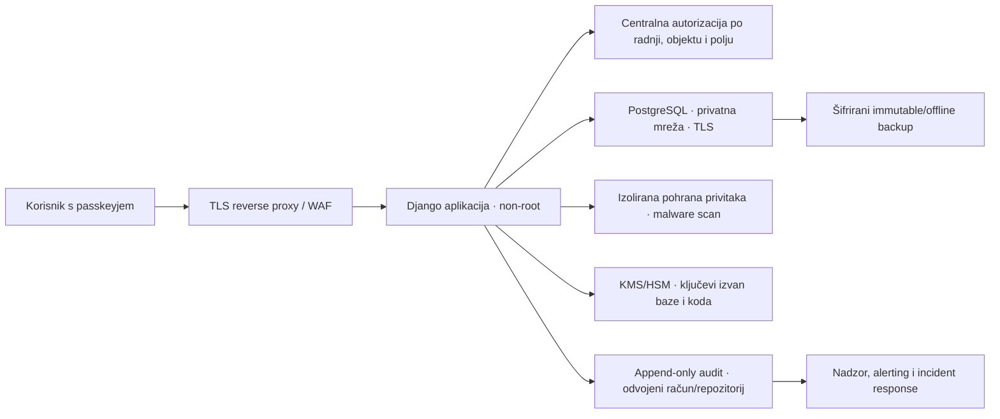

# Sigurnosni plan aplikacije Pastoral

Datum: 3. kolovoza 2026.  
Status: prijedlog za pregled i obvezna osnova prije rada sa stvarnim podacima  
Opseg: aplikacijski kod, identitet i pristup, zaštita podataka, infrastruktura, razvojni proces i operativni odgovor

## 1. Izvršni sažetak

Pastoral obrađuje podatke čiji kompromis može prouzročiti vrlo ozbiljnu i trajnu štetu:

- pripadnost vjerskoj zajednici i sakramentalnu povijest;
- podatke djece i obitelji;
- zdravstvene i pastoralne bilješke;
- podatke o preminulima i povezanim živim osobama;
- adrese, kontakte, obiteljske odnose i dokumente;
- financijske podatke, potpise, potvrde i službene matice;
- internu komunikaciju župe, dekanata i biskupije.

Vjerska uvjerenja i dio zdravstvenih podataka pripadaju posebnim kategorijama osobnih podataka prema članku 9. GDPR-a. Članak 32. zahtijeva tehničke i organizacijske mjere primjerene riziku, uključujući prema potrebi pseudonimizaciju, enkripciju, trajnu povjerljivost, cjelovitost, raspoloživost i redovito testiranje mjera. Izvorni tekst: [Uredba (EU) 2016/679, EUR-Lex](https://eur-lex.europa.eu/legal-content/HR/ALL/?uri=celex%3A32016R0679).

Zato cilj ne smije biti samo „proći security scan”. Cilj mora biti obrana u dubinu: kompromis jedne kontrole ne smije automatski značiti pristup svim podacima. Nijedan dokument ne može dokazati da je sustav „sigurniji od banke”; takva tvrdnja zahtijevala bi precizno definiran model prijetnji, neovisnu verifikaciju i kontinuirano operativno dokazivanje. Razumna visoka meta za ovaj projekt je:

- [OWASP ASVS 5.0](https://owasp.org/www-project-application-security-verification-standard/) razina 3 za cijelu aplikaciju;
- NIST AAL2 kao minimum za sve korisnike te phishing-resistant autentikacija za privilegirane uloge, prema [NIST SP 800-63B](https://pages.nist.gov/800-63-4/sp800-63b.html);
- načela najmanjih ovlasti, deny-by-default, potpune sljedivosti i odvajanja dužnosti;
- neovisni penetration test prije prvog produkcijskog pilota i nakon većih promjena sigurnosne arhitekture.

## 2. Nepregovarljiva sigurnosna pravila

1. **Nema stvarnih podataka dok P0 kontrole nisu završene.** Demo podaci moraju ostati izmišljeni.
2. **Deny by default.** Nepoznata uloga, stranica, akcija, župa ili objekt moraju završiti odbijanjem.
3. **Autentikacija nije autorizacija.** Prijavljen korisnik nema automatski pravo na podatke ni mutacije.
4. **Provjera na svakoj radnji i svakom objektu.** Skrivanje gumba ili navigacije nije sigurnosna kontrola.
5. **Najmanje ovlasti i need-to-know.** Korisnik vidi samo župe, module, predmete i polja potrebna za stvarnu službu.
6. **Nema zajedničkih korisničkih računa.** Svaka fizička osoba ima vlastiti identitet i autentikator.
7. **Nema običnog hard deletea službenih zapisa.** Matice, financijski zapisi, izdane isprave i audit imaju kontrolirani ispravak, opoziv ili rok čuvanja.
8. **Nema tajni u kodu, Git repozitoriju, slikama kontejnera ni logovima.**
9. **Nema osjetljivih podataka u browser storageu.** `localStorage` smije sadržavati samo bezopasne korisničke postavke; OWASP izričito upozorava da XSS ili lokalni pristup mogu kompromitirati sve podatke u njemu: [HTML5 Security Cheat Sheet](https://cheatsheetseries.owasp.org/cheatsheets/HTML5_Security_Cheat_Sheet.html).
10. **Fail securely.** Greška enkripcije, autorizacije, audita ili provjere integriteta mora zaustaviti radnju, a ne nastaviti s blažim pravilom.
11. **Sigurnosni događaj mora ostaviti trag.** Audit se ne smije moći mijenjati istim ovlastima kojima se mijenjaju poslovni podaci.
12. **Backup bez dokazanog restorea nije backup.**

## 3. Klasifikacija podataka

Svaki model, polje, dokument, export i log mora imati jednu klasifikaciju.

| Razina | Primjeri | Osnovne kontrole |
|---|---|---|
| Javno | javni raspored misa, objavljene obavijesti | integritet, odobrenje objave, CSP, zaštita od izmjene |
| Interno | zadaci bez osobnih podataka, opće operativne postavke | autentikacija, autorizacija po župi, audit izmjene |
| Povjerljivo | kontakti, adrese, financije, zahtjevi, privitci | MFA, objektna autorizacija, enkripcija, audit čitanja i izmjene |
| Strogo povjerljivo | vjerska pripadnost, sakramenti, podaci djece, zdravlje, pastoralne bilješke | phishing-resistant MFA, field-level pristup, enkripcija aplikacijskim ključem, audit svakog pristupa, ograničen export |
| Službeni nepromjenjivi zapis | matice, anotacije, zaključena financijska razdoblja, izdane isprave | append-only povijest, dvostruka kontrola, potpis/hash, WORM kopija audita, formalni ispravak |

Posebne domenske granice:

- pastoralna bilješka ne smije biti dostupna računovođi samo zato što vidi obitelj;
- financijski status ne smije određivati pastoralnu procjenu niti se prikazivati u pastoralnom radnom redu bez potrebe;
- zdravstveni detalj ne smije se kopirati u opći zadatak, podsjetnik, e-mail ili log;
- podaci djece trebaju stroži prikaz, export i rokove čuvanja;
- biskupija ne smije automatski vidjeti sve podatke župe; vidi samo ugovoreni skup ili formalno predani zapis;
- međužupni predmet prenosi najmanji potreban podatkovni paket, ne cijeli karton osobe.

## 4. Trenutačno stanje i kritični rizici

Ovo nije potpuni penetration test. Ovo su izravno potvrđeni problemi u sadašnjem kodu i konfiguraciji.

### 4.1. Identitet i OTP — kritično

Trenutačno:

- OTP se generira s `random.randint`, koji nije kriptografski generator;
- OTP se sprema čitljivo u bazu;
- provjera ne primjenjuje `OTP_TTL_MINUTES` kao stvarni rok;
- nema broja pokušaja, zaključavanja, rate limita ni zaštite od paralelnih challengea;
- kod se šalje na zajednički `OTP_RECIPIENT`, ne nužno vlasniku identiteta;
- nepoznati e-mail dobiva zadanu ulogu i korisnik se može automatski stvoriti;
- uspješna prijava prepisuje ulogu iz podatka spremljenog u sesiji;
- ručno uneseni OTP nije phishing-resistant; NIST izričito navodi da manualno uneseni OTP nije vezan uz legitimnu sesiju/verifiera.

Zaključak: sadašnji OTP je demo mehanizam i ne smije štititi stvarne podatke.

### 4.2. Autorizacija — kritično

Trenutačno:

- `role_permissions()` nepoznatoj ulozi dodjeljuje ovlasti župnika;
- `can_access_page()` nepoznatu stranicu dopušta;
- župnik i vikar imaju sve module;
- dozvole se primarno provjeravaju na stranicama, ali ne po API akciji i objektu;
- svaki prijavljeni korisnik može dohvatiti cijeli `Parish.data` JSON;
- `/api/action/` prima velik broj mutacija bez centralne mape potrebnih dozvola;
- `reset_demo` je dostupan svakom prijavljenom korisniku;
- nema stvarne veze korisnik–župa ni aktivne župe ovjerene na serveru;
- nema zaštite od pristupa objektu druge župe niti field-level kontrole.

OWASP preporučuje najmanje ovlasti, deny-by-default i provjeru ovlasti na svakom zahtjevu: [Authorization Cheat Sheet](https://cheatsheetseries.owasp.org/cheatsheets/Authorization_Cheat_Sheet.html).

### 4.3. Integritet i pohrana podataka — kritično

- gotovo svi poslovni podaci nalaze se u jednom JSON polju;
- svaka mutacija sprema cijeli dokument bez verzije, zaključavanja i detekcije izgubljene promjene;
- nema audit loga tko je što pročitao ili promijenio;
- nema kriptografske zaštite posebno osjetljivih polja na aplikacijskoj razini;
- čitanje može implicitno stvoriti ili reseedati zadanu župu;
- `reset_demo` može zamijeniti cijelu župnu evidenciju;
- nema formalne klasifikacije, rokova čuvanja, legal holda ni sigurnog brisanja;
- nema integritetskog lanca za matice, izdane dokumente i financijske zapise.

### 4.4. Web i prikaz sadržaja — visoko

- postoje brojni `innerHTML`/`outerHTML` putevi;
- više Django predložaka koristi `|safe` za spremljeni ili generirani HTML;
- rich-text sanitizacija odvija se u browseru, što nije sigurnosna granica;
- Chart.js se učitava s vanjskog CDN-a bez lokalnog vendoringa i stroge Content Security Policy arhitekture;
- CSV upload treba zaštitu od veličine, formula injectiona i resursnog iscrpljenja;
- budući privitci trebaju izoliranu pohranu i malware scanning.

Django upozorava na oprez pri korištenju `safe`, `mark_safe`, spremljenog HTML-a i uploadanog sadržaja: [Security in Django](https://docs.djangoproject.com/en/5.2/topics/security/).

### 4.5. Produkcijske postavke — kritično

`manage.py check --deploy --settings=zupa.settings.production` trenutačno vraća:

- grešku jer `STATIC_ROOT` pokazuje u isti direktorij kao `STATICFILES_DIRS`;
- nema HSTS-a;
- nema prisilnog HTTPS preusmjeravanja;
- postoji nesiguran razvojni fallback `SECRET_KEY`;
- session i CSRF cookieji nisu `Secure`;
- `X_FRAME_OPTIONS` nije `DENY`;
- `ALLOWED_HOSTS = ['*']` ne ograničava Host header;
- `DEBUG` se čita kao string pa vrijednost poput `"False"` može završiti istinita;
- produkcija koristi `runserver`, koji nije produkcijski server.

Službena Django deployment lista zahtijeva `check --deploy`, tajni nasumični ključ i zamjenu `runservera`: [Django deployment checklist](https://docs.djangoproject.com/en/5.2/howto/deployment/checklist/).

### 4.6. Infrastruktura — kritično

Trenutačni Compose je razvojni, ne produkcijski:

- PostgreSQL, Redis i Mailhog objavljuju portove hostu;
- postoje zadane lozinke `zupa` i `password`;
- Redis URL u servisima hardkodira lozinku `password` neovisno o `.env` vrijednosti;
- PostgreSQL `log_statement=all` može zapisati osjetljive vrijednosti;
- Mailhog sadrži OTP i sadržaj e-maila te ne smije postojati u produkciji;
- kontejneri mountaju cijeli izvorni kod kao writable volume;
- nema eksplicitnog non-root korisnika, read-only filesystema, capability dropa ni resource limita;
- nema TLS-a između aplikacije, baze i Redisa;
- nema odvojenog secrets managera, centralnog audita ni detekcije incidenta.

## 5. Ciljna sigurnosna arhitektura



Ključna svojstva:

- web proces nema administratorske ovlasti nad bazom, infrastrukturom ili auditom;
- svaka župa je tenant, a svaki pristup uključuje potvrđenu `ParishMembership` vezu;
- osjetljiva polja šifriraju se envelope encryptionom pomoću ključa iz KMS/HSM-a;
- baza, backup i audit koriste odvojene račune i ključeve;
- audit je append-only i periodično se kopira u immutable/WORM spremište;
- privitci se ne poslužuju s iste origin domene kao aplikacija;
- nijedan interni servis nije izravno dostupan internetu.

## 6. Identitet, autentikacija i oporavak računa

### 6.1. Preporučeni cilj

Primarna prijava treba biti **WebAuthn/passkey**:

- passkey je vezan uz stvarnu domenu i otporniji je na phishing;
- privilegirane uloge trebaju hardware-backed ili fizički sigurnosni ključ;
- e-mail OTP može privremeno ostati samo kao slabiji fallback tijekom migracije;
- SMS se ne preporučuje kao primarna kontrola;
- biometrijski podatak ostaje na uređaju; aplikacija prima kriptografski dokaz, ne biometriju.

NIST za AAL2 zahtijeva dva faktora i ponudu phishing-resistant opcije; AAL3 zahtijeva public-key kriptografski autentikator. OWASP također preporučuje FIDO/passkeys za snažnu autentikaciju: [OWASP Authentication Cheat Sheet](https://cheatsheetseries.owasp.org/cheatsheets/Authentication_Cheat_Sheet.html).

### 6.2. Upis korisnika

- nema samoregistracije;
- korisnika poziva ovlaštena osoba župe/biskupije;
- poziv je jednokratan, vremenski ograničen i vezan uz očekivani e-mail, župu i početnu ulogu;
- identitet se provjerava izvan aplikacije prema unaprijed odobrenom procesu;
- aktivacija mora registrirati najmanje dva autentikatora: primarni i recovery;
- dodavanje novog autentikatora zahtijeva postojeći snažni autentikator i obavijest korisniku;
- promjena e-maila, uloge ili župe zahtijeva step-up autentikaciju i audit;
- odlazak osobe automatski deaktivira sva članstva i sesije, ali ne briše audit.

### 6.3. Ako OTP privremeno ostane

Obvezno prije stvarnih podataka:

- generirati kod s `secrets`, ne `random`;
- ne spremati kod čitljivo; spremiti HMAC/Argon2 hash uz server-side pepper u KMS-u;
- rok najviše 5–10 minuta provjeravati server-side;
- jedan aktivan challenge po korisniku i svrsi;
- najviše pet pokušaja, zatim poništenje challengea;
- rate limit po računu, IP-u, uređaju i globalno;
- eksponencijalni backoff bez otkrivanja postoji li račun;
- kod slati isključivo na potvrđeni kanal vlasnika računa;
- challenge vezati uz session nonce, svrhu i približan kontekst;
- nakon uspjeha rotirati session ID i poništiti sve ostale challengee;
- ne vraćati primatelja, interne detalje ili exception tekst API klijentu;
- nikada ne zapisivati kod u log, admin, Celery result backend ili Mailhog u produkciji;
- kontinuirano pratiti brute-force i neuobičajene zahtjeve.

### 6.4. Oporavak i break-glass

- oporavak ne smije biti slabiji od redovne prijave;
- recovery codes se prikazuju jednom i spremaju hashirani;
- ručni oporavak zahtijeva dvije ovlaštene osobe i dokumentiran razlog;
- break-glass račun je fizički odvojen, bez svakodnevne uporabe, s hardware ključem;
- svaka break-glass prijava trenutno alarmira odgovornu osobu i zahtijeva naknadnu reviziju;
- nakon incidenta obvezno je rotirati autentikatore i pregledati sve radnje.

## 7. Autorizacija i odvajanje dužnosti

### 7.1. Model dozvola

Čisti RBAC nije dovoljan. Potreban je spoj:

- RBAC: uloga u župi, npr. župnik, vikar, tajnik, računovođa, biskupijski preglednik;
- ABAC: klasifikacija podatka, vrijeme, stanje predmeta, vrsta uređaja, step-up status;
- ReBAC: korisnik ima aktivno članstvo u konkretnoj župi/predmetu ili formalno dodijeljen zahtjev.

Svaka dozvola treba biti atomska, npr.:

- `family.read_contact`, `family.read_pastoral_note`;
- `sacrament.read`, `sacrament.correct`, `registry.annotate`;
- `finance.read`, `finance.post`, `finance.close_period`;
- `document.issue`, `document.revoke`;
- `interparish.share_minimal`, `diocese.submit_report`;
- `audit.read`, `audit.export`;
- `security.manage_membership`, `security.manage_authenticator`.

### 7.2. Centralna provedba

- napraviti jedinstveni `authorize(actor, action, resource, context)` servis;
- svaka view/API akcija poziva autorizaciju prije učitavanja osjetljivih podataka;
- queryset uvijek filtrira po dozvoljenim `parish_id` vrijednostima;
- serializer/context ne uključuje polje koje korisnik ne smije vidjeti;
- template i JavaScript dobivaju već filtriran rezultat;
- nepoznata akcija, stranica, uloga ili objekt vraća 403 i audit događaj;
- zabraniti generički `array_key` bez stroge allow-liste;
- `reset_demo`, import, export, masovne izmjene i promjene postavki dostupne su samo eksplicitnoj privilegiji;
- autorizacija se testira matricom uloga × akcija × tenant × stanje predmeta.

### 7.3. Dvostruka kontrola

Za sljedeće radnje jedna osoba ne smije sama inicirati i odobriti radnju:

- dodjela privilegirane uloge;
- pristup ili export masovnog skupa strogo povjerljivih podataka;
- ispravak službene matice;
- zatvaranje ili naknadna korekcija financijskog razdoblja;
- rotacija master ključa;
- trajno brisanje nakon isteka roka čuvanja;
- break-glass oporavak;
- promjena audit/retention postavki.

## 8. Sesije, CSRF i browser sigurnost

Produkcijske postavke trebaju sadržavati najmanje:

```python
DEBUG = False
ALLOWED_HOSTS = env_list('ALLOWED_HOSTS')
SECRET_KEY = env_required('SECRET_KEY')

SECURE_SSL_REDIRECT = True
SESSION_COOKIE_SECURE = True
SESSION_COOKIE_HTTPONLY = True
SESSION_COOKIE_SAMESITE = 'Strict'
CSRF_COOKIE_SECURE = True
CSRF_COOKIE_SAMESITE = 'Strict'
SECURE_HSTS_SECONDS = 300  # prvo kratki probni period
SECURE_HSTS_INCLUDE_SUBDOMAINS = True  # tek kad su svi subdomaini HTTPS-only
SECURE_HSTS_PRELOAD = False  # uključiti tek nakon formalne provjere
SECURE_CONTENT_TYPE_NOSNIFF = True
SECURE_REFERRER_POLICY = 'same-origin'
SECURE_CROSS_ORIGIN_OPENER_POLICY = 'same-origin'
X_FRAME_OPTIONS = 'DENY'
```

Napomene:

- `SECURE_PROXY_SSL_HEADER` postaviti samo ako pouzdani reverse proxy briše korisničke forwarded headere i sam postavlja ispravnu vrijednost;
- HSTS uvoditi postupno jer pogrešna konfiguracija može privremeno zaključati domenu;
- nakon prijave, promjene ovlasti i step-up autentikacije rotirati session key;
- apsolutni timeout za osjetljive uloge 8 sati ili kraće; idle timeout 15–30 minuta;
- financije, matice, export i sigurnosne postavke traže nedavnu step-up autentikaciju;
- korisnik mora moći vidjeti i opozvati vlastite aktivne sesije;
- promjena uloge, deaktivacija ili incident odmah opozivaju sve sesije;
- CSRF zaštita ostaje obvezna za svaku cookie-authenticated mutaciju;
- CORS ostaje isključen dok ne postoji odobren, zaseban klijent;
- postaviti strogi CSP bez `unsafe-inline` i `unsafe-eval`; postojeće inline stilove/skripte migrirati na nonce/hash ili lokalne datoteke;
- ukloniti third-party JavaScript gdje god je moguće; Chart.js vendorizirati i pinati hash/verziju.

Detaljne preporuke za session lifecycle: [OWASP Session Management Cheat Sheet](https://cheatsheetseries.owasp.org/cheatsheets/Session_Management_Cheat_Sheet.html).

## 9. API i poslovna logika

- svaki endpoint mora imati: autentikaciju, autorizaciju, CSRF gdje treba, limit veličine, schema validaciju i audit;
- API odgovori ne vraćaju cijeli parish JSON nego minimalni resurs/polja;
- input mora imati strogu schema allow-listu; ne spremati nepoznata polja;
- koristiti idempotency key za kritične i ponovljive mutacije;
- uvesti `version`/ETag i optimistic locking; konflikt vraća 409;
- kritične grupe mutacija izvoditi u `transaction.atomic()`;
- zaključavanje financijskog razdoblja i službenog zapisa provjerava se unutar iste transakcije;
- API greške klijentu daju generičan kod, a detalj ostaje u sigurnom logu;
- ograničiti pagination, pretragu, export i skupe filtere;
- rate limit primijeniti na login, search, export, import, generiranje dokumenata i javne obrasce;
- odvojiti javne forme od internog API-ja i baze kroz minimalan ingestion sloj;
- nikada ne dopustiti masovno dodjeljivanje modelskih polja iz `payload` objekta;
- URL identifikatori mogu biti UUID, ali se ne smiju smatrati autorizacijom;
- `reset_demo` potpuno ukloniti iz produkcijskog URL-a/builda.

## 10. Validacija, XSS i generirani dokumenti

### 10.1. Server je sigurnosna granica

- Django Form/schema validacija je obvezna i za UI i za API;
- sva HTML atributna polja moraju biti quoted;
- `|safe`, `mark_safe`, `innerHTML` i `outerHTML` vode se u registru trust sinkova;
- browser sanitizacija služi UX-u, ali server ponovno sanitizira sadržaj;
- koristiti provjerenu allow-list sanitizaciju: dozvoljeni tagovi, atributi, URL sheme i protokoli;
- ukloniti `<script>`, event handlere, `style`, `srcdoc`, opasne SVG/MathML konstrukcije i `javascript:` URL-ove;
- spremljeni rich-text čuva original samo ako je potreban za forenziku i tada nije renderabilan; korisnički prikaz koristi sanitiziranu verziju;
- ispisani dokument koristi nepromjenjivu sanitiziranu snimku i hash sadržaja;
- CSV/Excel export mora neutralizirati vrijednosti koje počinju s `=`, `+`, `-`, `@` radi formula injectiona;
- PDF renderer mora biti izoliran, bez mrežnog pristupa i pristupa lokalnim datotekama.

### 10.2. Content Security Policy

Početna meta:

```text
default-src 'none';
base-uri 'none';
frame-ancestors 'none';
form-action 'self';
connect-src 'self';
img-src 'self' data:;
font-src 'self';
style-src 'self';
script-src 'self' 'nonce-<request-nonce>';
object-src 'none';
manifest-src 'self';
upgrade-insecure-requests;
```

Prvo koristiti `Content-Security-Policy-Report-Only`, prikupiti izvještaje, ukloniti inline/CDN ovisnosti i tek zatim uključiti enforcement.

## 11. Privitci i upload

Upload je zasebna sigurnosna domena. OWASP smjernice: [File Upload Cheat Sheet](https://cheatsheetseries.owasp.org/cheatsheets/File_Upload_Cheat_Sheet.html).

Obvezni tok:

1. zahtjev prolazi autentikaciju, autorizaciju, CSRF i rate limit;
2. reverse proxy odbija prevelik body prije Djanga;
3. server generira nasumično ime; korisničko ime ostaje samo kao metapodatak;
4. provjeravaju se ekstenzija, MIME, magic bytes i stvarni parser;
5. dopušta se mala allow-lista formata;
6. datoteka odlazi u quarantine bucket izvan web roota;
7. antivirus/CDR servis obrađuje datoteku bez mreže i minimalnim ovlastima;
8. tek čista datoteka dobiva status dostupno;
9. download koristi kratkotrajni signed URL ili autorizirani streaming endpoint;
10. response postavlja siguran `Content-Disposition: attachment`, `nosniff` i točan MIME;
11. upload, scan, download i dijeljenje ulaze u audit.

Zabrane:

- nema izvršnih datoteka, HTML-a, SVG-a, makro-enabled Office dokumenata ni proizvoljnih arhiva bez izričite potrebe;
- nema poslužavanja korisničkih datoteka s iste origin domene;
- nema direktnog patha iz korisničkog unosa;
- nema javnog bucket/list pristupa;
- nema trajnog signed URL-a.

## 12. Enkripcija i upravljanje ključevima

### 12.1. Slojevi

1. TLS 1.2/1.3 za browser–proxy, proxy–app, app–PostgreSQL, app–Redis i servisne veze.
2. Enkripcija diska/volumena štiti izgubljeni fizički medij.
3. Enkripcija backupova zasebnim ključem štiti kopije.
4. Aplikacijska envelope enkripcija štiti od krađe baze ili backup dumpa.
5. Kriptografski integritet/potpis štiti audit i službene zapise od neprimjetne izmjene.

### 12.2. Ključevi

- master key mora biti u KMS/HSM/Vault sustavu, nikada u bazi ili `.env` datoteci na istom serveru;
- svaka župa ili sigurnosna domena dobiva zaseban data-encryption key (DEK);
- u bazi se sprema ciphertext, nonce, algoritam, key ID i verzija;
- koristiti AEAD, npr. AES-256-GCM ili ChaCha20-Poly1305, kroz provjerenu biblioteku;
- ključevi imaju svrhu, vlasnika, verziju, rok rotacije i audit uporabe;
- backup key, audit signing key i aplikacijski DEK nisu isti ključ;
- rotacija mora podržati read-old/write-new i kontroliranu re-enkripciju;
- pristup ključu je uži od pristupa aplikaciji i zahtijeva odvojeni administratorski identitet;
- uništenje ključa provodi se samo prema retention/legal-hold pravilima i uz dvostruku kontrolu.

OWASP preporučuje threat model i odvojeni key-management sustav: [Cryptographic Storage Cheat Sheet](https://cheatsheetseries.owasp.org/cheatsheets/Cryptographic_Storage_Cheat_Sheet.html) i [Key Management Cheat Sheet](https://cheatsheetseries.owasp.org/cheatsheets/Key_Management_Cheat_Sheet.html).

### 12.3. Pretraživanje šifriranih podataka

Ne uvoditi „encrypt everything” bez modela pretrage. Za točna pretraživanja može se koristiti zaseban keyed blind index, npr. HMAC normalizirane vrijednosti, uz:

- zaseban index key;
- zaštitu od enumeracije za polja malog skupa vrijednosti;
- strogo ograničenje tko smije pretraživati;
- audit svake osjetljive pretrage;
- zabranu logiranja upita.

## 13. Podatkovni model za sigurnost

Uz poslovne modele iz `PRIJEDLOG_MODELA_I_REFAKTORA.txt` potrebni su:

### Identity i pristup

- `ParishMembership(user, parish, role, status, valid_from, valid_until)`;
- `PermissionGrant(subject, permission, resource_scope, granted_by, expires_at)`;
- `Authenticator(user, type, credential_id, public_key, counter, assurance, status)`;
- `RecoveryCode(user, code_hash, used_at)`;
- `UserSession(user, session_hash, device_label, created_at, last_seen_at, revoked_at)`;
- `AccessReview(scope, reviewer, due_at, completed_at)`.

### Audit

- `AuditEvent(id, occurred_at, actor_id, acting_membership_id, action, resource_type, resource_id, parish_id, outcome, reason_code, request_id, source_ip_prefix, user_agent_hash, before_hash, after_hash, previous_event_hash, signature)`;
- `SecurityAlert(type, severity, state, first_seen, last_seen, assigned_to)`;
- `DataExport(id, requester, approver, scope, purpose, row_count, file_hash, expires_at)`.

Audit događaj ne sadrži OTP, session ID, ključ, puni dokument, zdravstvenu bilješku niti osjetljivi sadržaj. OWASP navodi da autentikacije, privilegirane radnje, pristup osjetljivim podacima, export i promjene konfiguracije treba bilježiti, ali tajne i osjetljivi sadržaj treba maskirati: [Logging Cheat Sheet](https://cheatsheetseries.owasp.org/cheatsheets/Logging_Cheat_Sheet.html).

### Zaštita podataka

- `DataClassification(resource_type, field_name, level, retention_policy)`;
- `ConsentRecord(subject, purpose, notice_version, captured_at, source, withdrawn_at)`;
- `RetentionPolicy(record_type, legal_basis, duration, action, approver)`;
- `LegalHold(record_scope, reason, starts_at, ends_at, approved_by)`;
- `EncryptionEnvelope(resource_type, resource_id, key_id, algorithm, nonce, ciphertext)` gdje field-level pristup nije dovoljan kroz model;
- `DeletionRequest` i `DeletionExecution` s dokazom što je obuhvaćeno ili izuzeto.

## 14. Audit, monitoring i detekcija

### 14.1. Događaji koji se uvijek bilježe

- uspješna i neuspješna prijava, challenge i recovery;
- dodavanje/uklanjanje autentikatora;
- stvaranje, deaktivacija i promjena uloge/članstva;
- svaki odbijeni autorizacijski pokušaj;
- čitanje strogo povjerljivog kartona ili bilješke;
- svaka izmjena matice, financije, dokumenta, privole i retentiona;
- import, export, print, download i masovna pretraga;
- uporaba privilegirane/break-glass funkcije;
- promjena konfiguracije, ključa, CSP-a, backup politike ili audita;
- upload i rezultat malware scana;
- neočekivani HTTP verb, validation failure visoke sigurnosti i anomalija poslovnog tijeka.

### 14.2. Zaštita audita

- aplikacija ima samo append ovlast;
- poslovni administrator nema delete/update audita;
- audit se u gotovo realnom vremenu šalje na odvojeni sustav;
- koristiti hash chaining i periodični digitalni potpis/checkpoint;
- immutable retention/WORM kopija;
- svaki pristup auditu se također auditira;
- satovi svih sustava sinkronizirani su preko zaštićenog NTP-a;
- logovi imaju request/correlation ID, ali ne i tajne.

NIST SP 800-53 zahtijeva zaštitu audit informacija od neovlaštenog pristupa, izmjene i brisanja te preporučuje odvojeno spremište i kriptografsku zaštitu: [NIST SP 800-53 Rev. 5](https://csrc.nist.gov/Pubs/sp/800/53/r5/FPD).

### 14.3. Alerting

Odmah alarmirati:

- više OTP/passkey neuspjeha ili zahtjeva za oporavak;
- login iz nove države/ASN-a ili nemoguće putovanje;
- dodjelu privilegirane uloge;
- masovni export ili neuobičajeno mnogo čitanja;
- pristup velikom broju dječjih/zdravstvenih/sakramentalnih zapisa;
- bypass pokušaj tuđe župe ili predmeta;
- promjenu audita, log pipelinea ili ključa;
- neočekivanu promjenu sheme ili integriteta službenog zapisa;
- gašenje backupova, malware skenera ili monitoringa.

## 15. Backup, oporavak i raspoloživost

### 15.1. Pravilo 3-2-1-1-0

- najmanje tri kopije;
- na dva različita medija/sustava;
- jedna kopija izvan primarne lokacije;
- jedna offline ili immutable kopija;
- nula neprovjerenih grešaka nakon automatizirane verifikacije i restore testa.

CISA preporučuje offline, šifrirane backupove i redovito testiranje povrata jer ransomware često pokušava pronaći i uništiti dostupne kopije: [#StopRansomware Guide](https://www.cisa.gov/stopransomware/ransomware-guide).

### 15.2. Konkretne kontrole

- PostgreSQL point-in-time recovery s WAL arhivom;
- dnevni backup i češći inkremental/WAL prema utvrđenom RPO-u;
- backup se šalje preko zasebnog računa koji ne može brisati stare kopije;
- enkripcija prije napuštanja DB sustava;
- key escrow/recovery plan odvojen od backup podataka;
- kvartalni puni restore u izolirano okruženje;
- mjesečna automatska provjera čitljivosti i integriteta;
- dokazani RPO i RTO po domeni;
- backup mora obuhvatiti DB, privitke, audit checkpointove, konfiguraciju i potrebne verzije aplikacije;
- restore ne smije automatski poslati e-mail, SMS ili pozadinske zadatke;
- rezultat svakog testa ulazi u audit i incident proces.

## 16. Infrastruktura i deployment

### 16.1. Produkcijski Compose/orkestracija

- razvojni `docker-compose.yml` ne koristiti u produkciji;
- PostgreSQL, Redis i Mailhog nemaju host portove;
- Mailhog uopće nije dio produkcijske topologije;
- zamijeniti zadane lozinke dugim nasumičnim tajnama iz secrets managera;
- Redis mora biti privatni, TLS zaštićen, ACL ograničen i bez osjetljivih Celery rezultata;
- Postgres mora zahtijevati TLS i certifikat validation; službena dokumentacija potvrđuje TLS podršku: [PostgreSQL secure TCP/IP connections](https://www.postgresql.org/docs/current/ssl-tcp.html);
- koristiti zasebne DB role za migracije, aplikaciju, read-only reporting i backup;
- aplikacijska DB rola nema `SUPERUSER`, `CREATEDB`, `CREATEROLE`, schema ownership ni nepotrebni DDL;
- razmotriti PostgreSQL Row Level Security kao drugi sloj tenant izolacije;
- `log_statement=all` isključiti za osjetljivu produkciju; koristiti ciljano auditiranje bez vrijednosti parametara;
- web pokretati preko Gunicorna/Uvicorna iza reverse proxyja, ne `runserver`;
- container image pinati digestom, skenirati, potpisati i graditi minimalno;
- container radi kao non-root, s read-only root filesystemom, `no-new-privileges`, dropanim capabilities i seccomp profilom;
- writable direktoriji su eksplicitni tmpfs/volume;
- source code se ne mounta writable u produkciju;
- postaviti memory/CPU/PID limite i health checkove;
- egress allow-list: aplikacija smije zvati samo nužne servise;
- admin pristup samo preko VPN/ZTNA i individualnog MFA identiteta;
- Docker rootless način smanjuje posljedice kompromisa daemona/runtimea: [Docker rootless mode](https://docs.docker.com/engine/security/rootless/).

### 16.2. Mreža

- internet vidi samo reverse proxy na 443;
- DB, Redis, object storage, KMS i audit su na privatnim segmentima;
- default-deny firewall između segmenata;
- management plane je odvojen od application planea;
- nema javnog SSH-a; pristup je vremenski ograničen i auditiran;
- TLS certifikati se automatski obnavljaju i nadziru;
- koristiti DNSSEC/CAA gdje infrastruktura dopušta;
- e-mail domena mora imati SPF, DKIM i DMARC s postupnim prelaskom na reject.

### 16.3. Tajne

- produkcija mora odbiti pokretanje ako nedostaje `SECRET_KEY`, DB lozinka ili ključ;
- nema development fallbacka u produkcijskim postavkama;
- tajne dolaze iz Vault/KMS/managed secrets servisa kao kratkotrajne vjerodajnice gdje je moguće;
- rotacija se testira i ne zahtijeva rebuild imagea;
- CI nema trajne produkcijske ključeve; koristi workload identity/OIDC;
- secret scanning blokira commit i CI build;
- incident s tajnom znači rotaciju, ne samo brisanje iz Gita.

## 17. Privatnost i životni ciklus podataka

- za svaku vrstu obrade dokumentirati svrhu, pravnu osnovu, kategorije, primatelje i rok;
- provesti DPIA prije produkcijskog korištenja zbog opsega posebnih kategorija, djece i sustavnog povezivanja podataka;
- privacy notice mora imati verziju; prihvaćanje/obavijest sprema vrijeme i izvor;
- ne koristiti privolu kao univerzalnu pravnu osnovu; pravnu osnovu potvrđuje stručna osoba za zaštitu podataka;
- minimizirati obvezna polja javnih obrazaca;
- testni, staging i analitički sustavi ne smiju koristiti produkcijske podatke; koristiti sintetičke podatke;
- export ima svrhu, odobrenje, minimalni opseg, watermark, hash i rok automatskog isteka;
- e-mail ne prenosi strogo povjerljive podatke ni privitke; šalje samo obavijest i sigurnu kratkotrajnu poveznicu;
- rok čuvanja provodi se automatizirano, uz legal hold i dokaz izvršenja;
- brisanje mora obuhvatiti primarne podatke, cache, search indexe, privitke i definirani backup lifecycle;
- matične i druge zakonski/kanonski obvezne evidencije ne brišu se prema običnom korisničkom zahtjevu bez pravne analize; koriste se ograničenje pristupa, anotacija i formalni postupak.

## 18. Secure SDLC i dobavni lanac

Svaki pull request mora proći:

- dva pregleda za security-kritični kod;
- unit i integration testove autorizacije;
- SAST za Python i JavaScript;
- dependency/SCA provjeru s blokadom poznatih kritičnih ranjivosti;
- secret scan;
- lint i type check;
- test migracija unaprijed i rollback/forward-fix plana;
- template/XSS i CSP testove;
- container i IaC scan;
- generiranje SBOM-a;
- potpis artefakta i provjeru potpisa pri deploymentu.

Periodično:

- tjedno automatsko dependency praćenje;
- mjesečni pregled privilegiranih računa i ranjivosti;
- kvartalni access review svih članstava;
- kvartalni restore test;
- godišnji threat-model workshop i neovisni penetration test;
- penetration test nakon promjene autentikacije, tenant izolacije, enkripcije ili privitaka;
- program odgovornog prijavljivanja ranjivosti i `security.txt`.

ASVS 5.0 treba pretvoriti u verzioniranu tablicu zahtjeva s dokazom: implementacija, automatizirani test, ručni test, vlasnik i datum zadnje provjere.

## 19. Sigurnosni testovi koji moraju postojati

### Autentikacija

- OTP isteče, ne može se ponovno koristiti i zaključava se nakon limita;
- generična poruka ne otkriva postoji li korisnik;
- rate limit radi po više dimenzija;
- session se rotira nakon prijave i promjene ovlasti;
- deaktivirani korisnik i opozvana sesija odmah gube pristup;
- passkey challenge je jednokratan, vezan uz origin/RP ID i provjerava counter gdje je primjenjivo.

### Autorizacija

- svaka uloga × svaka akcija × vlastita/tuđa župa;
- nepoznata uloga/akcija/stranica je odbijena;
- korisnik ne može pogoditi tuđi UUID i dobiti podatak;
- field-level kontrola skriva pastoralne/zdravstvene/financijske detalje;
- export, print i search imaju iste ili strože kontrole od običnog prikaza;
- promjena `parish_id`, `array_key`, `owner_id` ili statusa u payloadu ne zaobilazi pravila.

### Podaci i integritet

- paralelne izmjene ne prepisuju jedna drugu;
- zaključani zapis nije izmjenjiv normalnom akcijom;
- audit događaj nastaje i kod uspjeha i kod odbijanja;
- audit lanac otkriva izmjenu ili brisanje;
- ciphertext se ne može zamijeniti između tenanata/polja bez AEAD greške;
- key rotation i restore vraćaju čitljive i cjelovite podatke.

### Web

- stored/reflected/DOM XSS testovi za svaki HTML sink;
- CSRF testovi za svaku mutaciju;
- CSP nema `unsafe-inline`/`unsafe-eval` u finalnoj fazi;
- CSV formula injection;
- upload poligloti, MIME mismatch, zip bomb, path traversal i malware;
- Host header, cache poisoning, request smuggling na proxy sloju;
- limit veličine bodyja, paginationa i skupe pretrage.

## 20. Incident response

Potrebni su unaprijed odobreni playbookovi za:

- kompromitiran korisnički račun;
- ukradeni session/authenticator;
- curenje baze ili backupa;
- ransomware;
- kompromitiran master ključ;
- zlonamjerni insider;
- kompromitiran dependency ili CI/CD;
- pogrešno poslan export/e-mail;
- nedostupnost ili gubitak integriteta matica.

Svaki playbook definira:

1. tko smije proglasiti incident;
2. izolaciju bez uništavanja dokaza;
3. out-of-band komunikaciju;
4. očuvanje logova, snapshotova i chain-of-custodyja;
5. opoziv sesija, ključeva i vjerodajnica;
6. analizu opsega po osobi, župi i vrsti podatka;
7. pravnu/DPO procjenu obavještavanja, uključujući GDPR rokove;
8. siguran oporavak iz provjerenog izvora;
9. post-incident analizu i dokaz zatvaranja korektivnih mjera.

Kontakt lista i plan moraju postojati offline jer kompromitirani sustav/e-mail možda nisu sigurni za koordinaciju.

## 21. Prioritetni plan izvedbe

### P0 — prije bilo kakvih stvarnih podataka

1. Zabraniti produkcijski startup s development ključem, `DEBUG=True` ili wildcard hostom.
2. Ispraviti sve `check --deploy` greške i upozorenja, uz dokumentiranu proxy/HSTS odluku.
3. Uvesti produkcijski WSGI/ASGI server i HTTPS-only reverse proxy.
4. Ukloniti javne DB/Redis/Mailhog portove i sve zadane lozinke.
5. Zamijeniti postojeći OTP passkey/MFA sustavom ili potpuno ojačati privremeni OTP.
6. Zabraniti samostvaranje korisnika; uvesti pozive i potvrđeno članstvo korisnik–župa.
7. Promijeniti dozvole u deny-by-default.
8. Uvesti autorizaciju po svakoj API akciji, objektu, župi i osjetljivom polju.
9. Ukloniti produkcijski `reset_demo` i puni `parish_data_api` odgovor.
10. Uvesti audit loginova, autorizacije, osjetljivih čitanja, izmjena i exporta.
11. Uvesti transakcije i version/optimistic locking.
12. Server-side sanitizirati svaki rich-text/HTML put i inventarizirati sve `safe`/`innerHTML` sinkove.
13. Zabraniti stvarne podatke u test/staging/demou.
14. Uvesti šifrirane offline/immutable backupove i dokazani restore.
15. Izraditi DPIA, retention mapu i incident-response plan.
16. Neovisni review arhitekture i penetration test zatvaraju P0.

### P1 — prije ograničenog produkcijskog pilota

1. Relacijski modeli identiteta, članstva, predmeta, audita i službenih zapisa.
2. Field-level klasifikacija i envelope enkripcija strogo povjerljivih podataka.
3. KMS/HSM i formalna rotacija ključeva.
4. Centralni SIEM/alerting i odvojeni immutable audit.
5. Siguran upload pipeline i odvojena domena za sadržaj.
6. CSP enforcement i lokalni third-party JavaScript.
7. Dvostruka kontrola za matice, financije, privilegije, export i ključeve.
8. SBOM, potpisani imagei, SAST/DAST/SCA/secret scanning u CI-u.
9. Tenant isolation i autorizacijski regresijski suite.
10. Vježba incidenta i restorea s mjerljivim RPO/RTO rezultatima.

### P2 — zrela visokoosigurana platforma

1. Hardware security keys obvezni za privilegirane uloge.
2. PostgreSQL RLS kao dodatna tenant kontrola.
3. Privileged Access Management i vremenski ograničene admin ovlasti.
4. Automatizirane periodične access recertifikacije.
5. Kriptografski potpis/checkpoint službenih zapisa i audita.
6. Napredna detekcija anomalija uz strogu minimizaciju podataka.
7. Red-team vježbe i neovisna ASVS L3 verifikacija.
8. Multi-region/odvojeni disaster-recovery prema stvarnom riziku i potrebama.

## 22. Sigurnosni release gate

Produkcijski release se blokira ako vrijedi bilo što od sljedećeg:

- `check --deploy` ima grešku ili neobjašnjeno sigurnosno upozorenje;
- postoji critical/high nalaz bez formalno odobrene iznimke i roka;
- autorizacijska matrica ili tenant test ne prolazi;
- migracija/restore test ne prolazi;
- SBOM ili dependency scan sadrži neobrađenu kritičnu ranjivost;
- secret scan pronađe tajnu;
- audit za kritične akcije nije potpun;
- nema rollback/forward-fix plana;
- produkcijski artefakt nije potpisan ili se razlikuje od testiranog artefakta;
- promjena enkripcije/ključa nema test čitanja starih podataka;
- sigurnosno odgovorna osoba nije odobrila promjenu visokog rizika.

## 23. Što kod ne može sam osigurati

Čak i savršen Django kod ne može nadoknaditi:

- kompromitiran administratorski laptop ili e-mail;
- slabu fizičku zaštitu servera i recovery ključeva;
- nepostojanje procesa deaktivacije korisnika;
- zajedničke račune i dijeljenje autentikatora;
- neprovjerene backupove;
- kompromitiran DNS, reverse proxy, CI/CD ili cloud administratorski račun;
- neobučene korisnike i phishing;
- pogrešno definirane pravne osnove, rokove čuvanja i ovlaštene primatelje;
- nepostojanje osobe odgovorne za nadzor i incidente.

Zato su tehničke i organizacijske mjere jedan sustav. Vlasnici moraju biti imenovani za: sigurnost aplikacije, infrastrukturu, zaštitu podataka/DPO, poslovne ovlasti, audit, incident response i backup/oporavak.

## 24. Preporučeni sljedeći korak u ovom repozitoriju

Ne uključivati sve kontrole odjednom. Prva sigurnosna implementacijska grana treba sadržavati samo:

1. produkcijske postavke koje failaju zatvoreno;
2. sigurniji model članstva korisnik–župa;
3. centralnu deny-by-default autorizaciju po API akciji;
4. novi audit model i middleware/service;
5. sigurniji privremeni OTP s TTL-om, hashom, limitima i bez samostvaranja računa;
6. testove za sva prethodna pravila;
7. odvojeni production Compose/deployment primjer bez javne baze, Redisa i Mailhoga.

Tek nakon toga treba uvoditi field-level enkripciju, jer ona ovisi o potvrđenom modelu tenanta, KMS-u, backupu, pretrazi i rotaciji ključeva. Naivna enkripcija bez upravljanja ključevima može povećati rizik trajnog gubitka podataka.

## 25. Referentni standardi

- [OWASP Application Security Verification Standard 5.0](https://owasp.org/www-project-application-security-verification-standard/)
- [Django 5.2 Security](https://docs.djangoproject.com/en/5.2/topics/security/)
- [Django Deployment Checklist](https://docs.djangoproject.com/en/5.2/howto/deployment/checklist/)
- [Django Security Checks](https://docs.djangoproject.com/en/5.2/ref/checks/)
- [NIST SP 800-63B — Authentication and Authenticator Management](https://pages.nist.gov/800-63-4/sp800-63b.html)
- [NIST SP 800-53 Rev. 5](https://csrc.nist.gov/Pubs/sp/800/53/r5/FPD)
- [OWASP Authorization Cheat Sheet](https://cheatsheetseries.owasp.org/cheatsheets/Authorization_Cheat_Sheet.html)
- [OWASP Authentication Cheat Sheet](https://cheatsheetseries.owasp.org/cheatsheets/Authentication_Cheat_Sheet.html)
- [OWASP Session Management Cheat Sheet](https://cheatsheetseries.owasp.org/cheatsheets/Session_Management_Cheat_Sheet.html)
- [OWASP Cryptographic Storage Cheat Sheet](https://cheatsheetseries.owasp.org/cheatsheets/Cryptographic_Storage_Cheat_Sheet.html)
- [OWASP Logging Cheat Sheet](https://cheatsheetseries.owasp.org/cheatsheets/Logging_Cheat_Sheet.html)
- [OWASP File Upload Cheat Sheet](https://cheatsheetseries.owasp.org/cheatsheets/File_Upload_Cheat_Sheet.html)
- [CISA StopRansomware Guide](https://www.cisa.gov/stopransomware/ransomware-guide)
- [Uredba (EU) 2016/679 — GDPR](https://eur-lex.europa.eu/legal-content/HR/ALL/?uri=celex%3A32016R0679)

